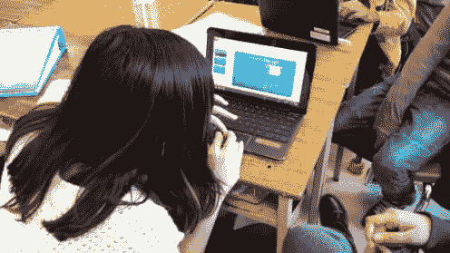

# 拒绝创造就不可能伟大！

> 原文：<https://medium.com/swlh/you-cant-be-great-if-you-refuse-to-create-f30eb34066bf>

**Commitment to preparing our students for their futures also requires self-directed learning**

我想我们都听过这样一句话，“不要重新发明轮子”——作为教育工作者，我们甚至可能以此为借口，用其他人的课程(我们可能会或可能不会在交付前真正通读)或我们可能应该停止使用或至少更新的资源来“教”我们的学生。出于某种原因，当谈到我们的课程是如何组合在一起的时候，我们许多人都拒绝冒险:我们是习惯的动物，我们“知道什么是有效的”，我们已经完成了整个单元(嘿，我能得到一份复印件吗？)—对于我们在满足学习者需求方面缺乏创造力，还有更多无力的解释(这种情况每年都会发生变化！)，但我就讲到这里了。

这是老生常谈，但我们生活在一个创意无限的时代。我们有工具让我们的学生在展示他们的理解时具有创造性和表现力，从我们老师的角度来看，我们有工具可以以我们尚未体验的方式激发和扩大我们的教学。如果我们愿意创造，这都是真的——在许多情况下，这就是问题所在。我们似乎在寻找技术来取代我们的教学…你看，当我们使用教科书时，艰难的一天可以相当于 30 分钟的教学时间，其中“将你的课文翻到 45 页，阅读前三段，并在笔记本上做问题 1 至 6”是课程。我们都是人，所以我想我们可以理解，在某些日子里，我们希望我们可以告诉我们的学生独立阅读…大约五个小时。是的，创造需要精力、实践和承诺(这只是计划的一部分，我们甚至还没开始上课呢！)——但如果我们想变得伟大，我们需要将所有这些东西与我们在这一点上都能接触到的强大媒介结合起来。

明年，我将在一所新学校教书，一旦我花时间与我的同事建立了一些关系，我将鼓励我的同事不仅使用我们可用的工具，而且要成为我们学生的内容创作典范。那是什么意思？那得看情况。这可能意味着我们实际上正在使用各种各样的演示工具向我们的学生展示内容，同时让他们学习如何使用这些工具进行创作。这可能意味着我们将超越使用模板和来自几个应用程序的预先录制的课程来进行协作，并从零开始创建我们自己的课程！(不是*跟*刮，那完全是两码事！).成为内容创作者的模型可能就像上一堂课一样简单(甚至是数学课本上的！)并把它变成智能板上的互动体验——同样，用我们自己的创造力，使用我们可用的工具。诚然，我们看到的一些最有用的工具被贴上了“学生驱动”的标签——但这并不意味着我们可以为学生省去建模的部分。当然，这意味着我们必须自己学习如何使用这些工具进行创作…而且你猜怎么着，一旦你开始了，你将无法停止！学习如何在这些工具提供的虚拟环境中工作所需的时间很少，也不多(取决于你对数字工具的个人舒适度)，但潜在的回报是巨大的**你将帮助你的学生为未来做好准备，在未来，创造性和批判性思维的能力将是最有价值的技能。**

现在可能是过去 20 年里告诉同事或教学伙伴的最佳时机:“我们 ***应该*** 重新发明轮子！”这么说吧，奥维尔和维尔伯·莱特显然没有发明轮子；他们创造了一些东西，可以带我们去轮子不能去的地方。当我们决定是时候创造的时候，我很兴奋地看到我们能够创造什么，以及我们能够去的地方。