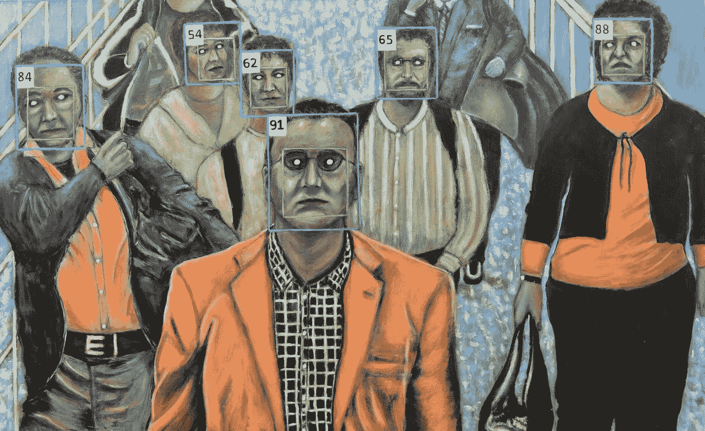

# 你不能控制一切。识别你能识别的。

> 原文：<https://medium.com/swlh/you-cant-control-everything-recognize-what-you-can-7e9e1a9af2e1>

[Facial Recognition — Sergio Paul Ianniello](http://assets.saatchiart.com/saatchi/826512/art/5171675/4241495-PWFMPDBV-8.jpg)

## 一个作家的沮丧，一个斯多葛派的解决

人类渴望控制。

当我们拥有它的时候，我们会觉得被赋予了力量，而且它本质上是安全和可预测的。

但是我们不能一直拥有它。有时我们没有。