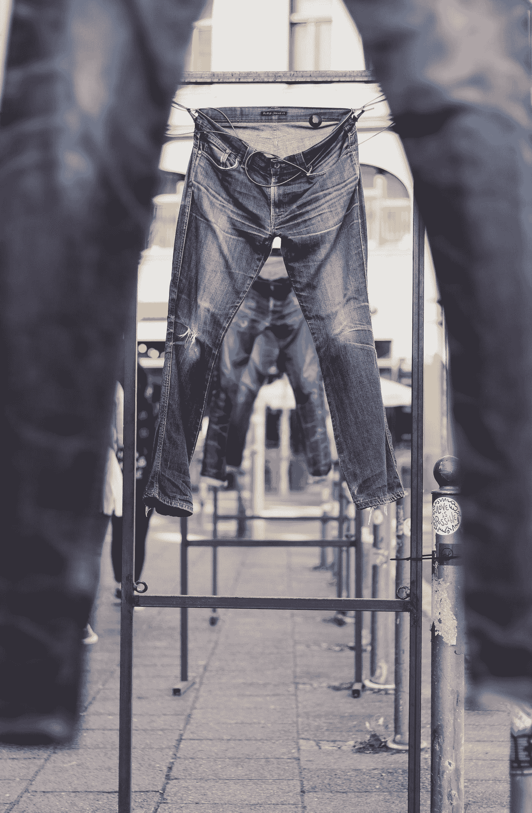

# 你不能凭直觉行事

> 原文：<https://medium.com/swlh/you-cant-hustle-by-the-seat-of-your-pants-619a12e09737>

有目的的思考和行动对实现你的目标至关重要——请记住这一点。

Photo by [Crawford Jolly](https://unsplash.com/@crawford?utm_source=medium&utm_medium=referral) on [Unsplash](https://unsplash.com?utm_source=medium&utm_medium=referral)

试图一边忙碌一边实现梦想绝非易事。它需要精力和时间——当你全职工作时，这两样都是短缺的。作为一个母亲、妻子、老师和无所不在的忙碌女士，我正试图以作家的身份获得吸引力。