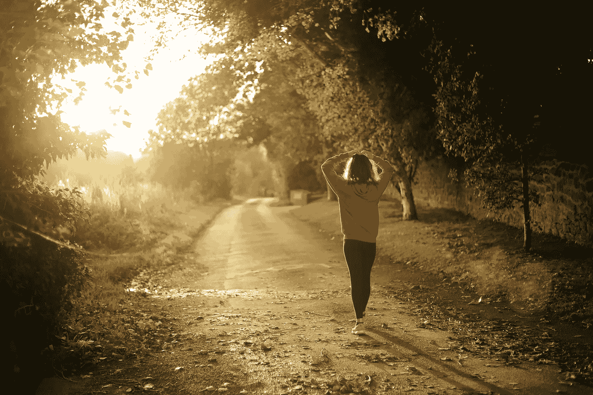

# 你不能逃避你的问题，但是你可以解决它们

> 原文：<https://medium.com/swlh/you-cant-run-from-your-problems-66127746c4d6>

## 一次晨跑如何改变了我的生活

Photo by [Emma Simpson](https://unsplash.com/@esdesignisms?utm_source=unsplash&utm_medium=referral&utm_content=creditCopyText) on [Unsplash](https://unsplash.com/?utm_source=unsplash&utm_medium=referral&utm_content=creditCopyText)

跑步不是最有效的运动形式，所以当我的通勤时间在几年前增加了近一倍时，我把它放在一边，转而选择更多的家庭有氧运动，如 HIIT(高强度间歇训练)。