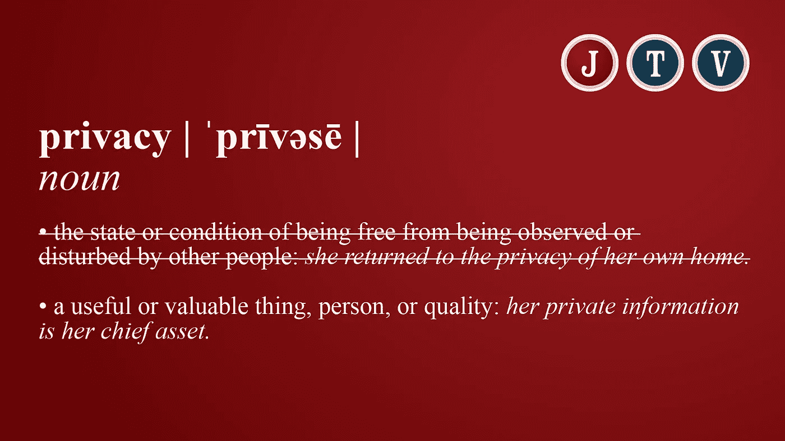

# 你没有隐私权。你有更好的东西

> 原文：<https://medium.com/swlh/you-dont-have-a-right-to-privacy-you-have-something-better-3ad542040db0>

It’s time we redefined privacy.

如果没有隐私权呢？

这个问题引发了许多人的愤怒，尤其是在西方世界。我们把“隐私”排在“言论自由”和“信仰自由”的前面但是正如我们所看到的(特别是在过去 20 年的信息革命中)，隐私的概念已经变得更加复杂。