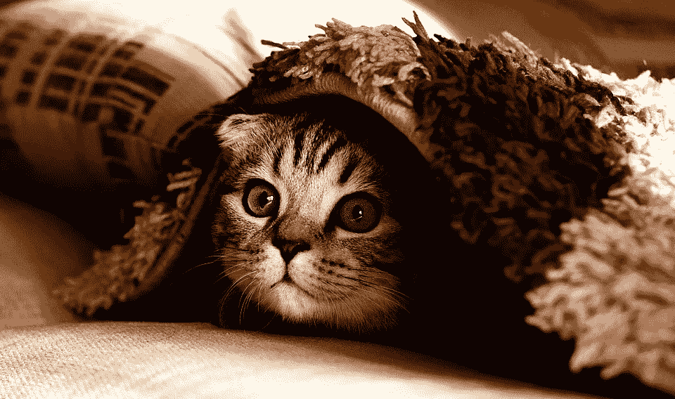

# 你没什么好隐瞒的

> 原文：<https://medium.com/swlh/you-dont-have-nothing-to-hide-13a75751b06>

21 世纪的隐私似乎是一个越来越模糊的概念。

在不太遥远的过去，只有我的密友才知道我在任何时候的行踪。很少有人知道我最近买了什么东西。我下班后去了哪里。我如何度过我的周末。

如今，由于技术的“进步”，需要付出非凡的努力才能将这些信息保密。即使你不是一个社交媒体过度分享者，电子 cookies，内置的移动 GPS 和复杂的面部识别系统也能让我们的一举一动可追踪，可追踪，并普遍知晓。

“但谁在乎呢？”我听到很多人问。“我没什么好隐瞒的！”。

不对。

每个人都有所隐瞒。

我的意思不是说普通人经营一个冰毒实验室来补充他们的日常工作，或者暗地里隐藏着玩弄孩子的倾向。我的意思是，每个人都有不愿意与外界分享的生活元素。

例如，当我独自一人在家，窗帘紧闭时，我非常乐意脱掉衣服，听着泰勒·斯威夫特的歌尽情摇滚。但是如果我穿着最少的衣服在客厅跳舞的镜头被传到网上——或者传到某个要求赔偿的人手中，让它远离网上的**——我就不会那么冷漠了。**

**当我排便不畅或长了令人讨厌的阴毛时，我可能会毫不犹豫地通知我的医生，但我可能更希望我的老板不知道。**

**我可能会告诉我的朋友周六晚上我会去哪里。但是如果那个令人毛骨悚然的家伙有眼肌抽搐和刀癖，可以知道我周末的行踪…嗯，我可能会把那些计划放在一边。**

**隐私不仅仅是隐藏我们做错的事情。这是关于保持个人的东西。**

**但是随着时间的推移和技术的进步，隐私正迅速成为过去。我们必须越来越努力地维护这一特权。**

**几乎每天，似乎都有新的故事出现，展示了我们的私人信息被用来对付我们的险恶和算计的方式。**

**美国广播公司发表的一篇[文章](http://www.abc.net.au/news/2018-10-09/why-your-airfare-cost-more-than-the-person-sitting-next-to-you/10350700)揭示了我们的在线习惯和网络历史实际上引导了我们在线购物的价格。**

**例如，在预订航班时，航空公司会访问我们的网络 cookies，以了解我们是否重复检查了某个特定的航班时间。作为对我们坚持不懈和耐心的回报，他们会提高价格——只是为了我们——安全地知道我们非常想要那趟航班，我们愿意为它付出几乎任何东西。**

**因此，我们乘坐飞机被收取 300 美元，而坐在我们旁边的人只需 150 美元就能获得他们的座位。**

**不要有任何幻想；这种对我们数据的卑鄙使用不仅限于航空公司的采购。无论是酒店预订、租车预订还是任何其他类型的预订，只要我们手头有足够的数据，企业就可以压榨我们，因为他们相信——不，**知道**——我们准备付费。**

**当然，科技公司非常乐意伸出援手。当然是以合适的价格。**

**谷歌和脸书虽然可以“免费”使用，却不知何故成为了世界上最富有的两家公司。你会问，怎么会？侵入我们的私人生活，出售我们随意捐赠的数据。这些数据对他们的**真正的**客户来说非常有价值。**

**史蒂夫·乔布斯[不让他的孩子使用电子设备](https://www.nytimes.com/2014/09/11/fashion/steve-jobs-apple-was-a-low-tech-parent.html)是有原因的。马克·扎克伯格[买下他自己周围所有的房子](https://www.businessinsider.com.au/mark-zuckerberg-buys-4-homes-for-privacy-2013-10?r=US&IR=T)并且用[黑色胶带覆盖他的手机和笔记本电脑摄像头](https://www.nytimes.com/2016/06/23/technology/personaltech/mark-zuckerberg-covers-his-laptop-camera-you-should-consider-it-too.html)是有原因的。**

**我不知道你是怎么想的，但是如果我的厨师不吃他们做的饭，那就有点不对劲。**

**所以我们的数据被公然窃取和出售。当涉及到我们的隐私时，那就不好了。但情况会变得更糟。**

**任何看过《黑镜》第一季的人都记得令人毛骨悚然的一集，其中一个社会信用体系定义了公民获得的奖励、特权和惩罚。随着情节的发展，无害的主角的生活越来越分崩离析，她经历了一系列不幸事件后，她的社会信用评分急剧下降。到了最后(剧透警报)，她已经完全无法维持自己作为社会一员的生活。**

**听起来很可怕，对吧？幸运的是这只是一个电视节目。**

**但事实并非如此。**

**中国目前正在实施类似的社会信用体系。它将公民的金融、社会、法律和政治信用评级整合到一个“方便的”集中的[社会信任度得分](https://www.businessinsider.com.au/china-social-credit-score-like-black-mirror-2016-10?r=US&IR=T)。这个分数可以被散布在城市各处的 50 亿台公共闭路电视摄像机监控和调整。当然，相机配备了复杂的面部识别技术。**

**就像在《黑镜》中一样，中国公民的分数决定了他们的特权和惩罚。**

**遵从政府的路线，做一个好孩子，缴纳税款，你可能会得到优惠利率，或者让你的孩子进入更好的学校。但是迟交一天房租或者——但愿不会这样——公开批评政府，你可能会被扣分……嗯，你可能会发现自己无法乘坐公共交通工具，无法租到房子，甚至无法离开这个国家。**

**这不是虚构的。这些不是阴谋。这些都是既定的真理。这就是我们生活的世界。这是真实的事情，已经发生在真实的人身上。**

**不要自大到认为这种奥威尔式的监控系统只在中国使用。**

**沃尔玛最近宣布打算在购物车上安装生物计量检测器，以测量购物者的心率、体温，甚至整个商店的移动速度。因为，你知道，很明显他们需要详细的生理数据来识别顾客什么时候有压力，什么时候需要帮助。**

**整个情况是真的，真的 f*@！由…编辑**

**但是我们能做什么呢？在我们的信息被收集、整理、兜售给出价最高的人，并被用作贿赂和勒索以保持民众顺从的时代，有什么方法可以保护我们的隐私？**

**幸运的是，确实存在一些保护我们隐私的系统。它们并不完美…但它们是一个开始。**

*   **[Brave](https://brave.com/) 是 Chrome、Explorer 和 Mozilla Firefox 的免费网络浏览替代品。它可以让你在网上漫游，不会弹出广告，也不会有 cookies 跟踪你的一举一动。**
*   **[Duck Duck Go](https://duckduckgo.com/) 是谷歌的替代互联网搜索引擎。与谷歌不同的是，它不跟踪你的搜索，因此不会调出它认为你应该看到的特定搜索结果。**
*   **像[专用互联网接入(PIA)](https://www.privateinternetaccess.com/) 这样的 VPN 允许数据在离开你的电脑时被加密，使你能够匿名浏览网页。**
*   **LastPass 是一个安全的密码存储网站。使用单一密码登录，它会提醒您需要的其他密码。通过这种方式，LastPass 使得所有东西都有不同的密码成为可能，为黑客创造了一个更大的工作，如果他们想窃取你的现金/身份。**

**如果这还不够……总会有更极端、更简单的选择。搬到树林里的小屋里，远离电网生活等等。**

**对于我们这些不太倾向于完全放弃我们所了解的生活的人来说，抛弃智能手机的便利可能是一个更合理的举动。老式的 Alcatels 和 Nokias 只是打电话和发送/接收短信，这让我们更难被跟踪——特别是如果我们的电脑配备了上述安全措施。**

**我知道这听起来很极端。当然，这可能需要不时地翻出一个 Melways 来帮助导航。并且音乐需要存储在替代设备上。你不能每三分钟更新一次你的脸书信息。**

**但是不久前我们还在做这些事情。不知何故我们活了下来。**

**现在剩下的唯一问题是我们更看重什么:我们的便利还是我们的隐私。**

**你的电话。**