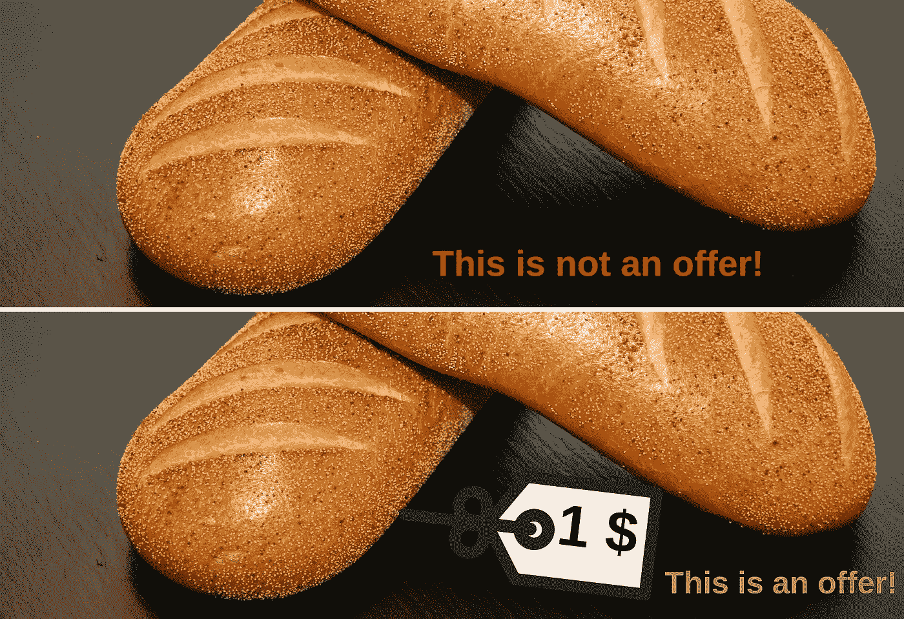

# 你不必是一个伟大的营销人员

> 原文：<https://medium.com/swlh/you-dont-have-to-be-a-great-marketer-fdc9731a2ba7>

## 你只需要找到 4 个问题的答案

We are bombarded with Ads on a daily basis! [Anthony Rosset](https://unsplash.com/@anthonyrosset?utm_source=medium&utm_medium=referral) on [Unsplash](https://unsplash.com?utm_source=medium&utm_medium=referral)

为了发展你的业务，有许多“大师”说，为了取得成功，你必须出现在每个平台上，以便人们可以在任何地方找到你。这就像在你要跑马拉松之前搬起石头砸自己的脚…

> 在《终极销售机器》一书中，曾与许多财富 500 强公司合作发展销售和营销的切特·霍姆斯讲述了他空手道之旅的故事。为了获得黑带，他没有练习 4000 个不同的动作，而是练习 3-4 个动作，每个动作 4000 次，并成为这些动作的大师。

因此，如果你将这一理念运用到你的业务中，你不必出现在每一个社交媒体网站上。你只需要选择 1-2 个，并在此基础上努力，直到你掌握它，并每天自动获得新的线索。

> 清晰的愿景是实现目标的关键。—汤姆·斯泰尔

现在让我们回到问题上来。不管你用什么平台，你都必须有一个很棒的副本。这些问题将有助于你更好地创造你的报价。正如你在下面的照片中看到的，为了在商业上取得成功，仅仅创造一个伟大的产品是不够的！

为了给顾客创造最好的产品，你必须在所有沟通中回答 4 个问题:

*   **什么？**
*   **为什么？**
*   **谁？**
*   **如何？**

现在让我们来谈谈每一个，并向您展示如何在您的业务中使用它们。

## 1.什么？

第一个问题是指你的客户可以问的关于你的产品的所有问题。如果你刚刚起步，没有太多的客户，那么谷歌是你的朋友。找一个类似的产品或服务，看看人们对此有什么看法，他们有什么问题。如果你卖的是可以在 Amazon.com 上找到的实物产品，看看评论部分所说的一切。

> 唯一比失明更糟糕的是有视力却没有视觉。——海伦·凯勒

你会学到很多关于你应该在谈话和营销材料中指出什么的知识。这个问题是一个逻辑问题。以下是一些你可以回答的问题:

*   我的产品或服务的主要好处是什么？
*   我的产品或服务解决了哪些问题？
*   客户在使用你的产品或服务后会经历怎样的转变？
*   人们在购买你提供的产品或服务时会考虑哪些因素？
*   你的客户可以通过哪五种方式使用你的产品或服务？
*   发挥创造力，创造至少 10 个“什么”问题并回答它们

## 2.为什么？

现在我们从逻辑部分转移到情感部分。在他的书《找到你的原因》中，西蒙·西内克认为这个问题是一个企业主能够回答的最重要的问题。他在某种程度上是正确的，因为如果你总是知道你为什么做某事，你会工作更长的时间，当你被击中时就站起来。当我写这一段的时候，时钟指着凌晨 3 点，我还在写。我的新年决心之一是决定每天做 3 件重要的事情，直到我把它们标记为完成，否则绝不睡觉。这篇文章是我今天要做的事情之一。

为什么还能帮助你的客户认同你的品牌和产品。现在，客户会关注那些有远见和好想法的公司。以下是一些例子:

*   优步——使命宣言——交通运输像自来水一样可靠，适用于任何地方的任何人——为什么？—因为没有可靠的交通工具，被困是很糟糕的。
*   Airbnb——使命宣言——通过一个社区市场，将世界各地现实生活中的数百万人联系起来——这样你就可以属于任何地方。—为什么？——因为旅行可以而且应该比住酒店更亲密。
*   bell Roy——使命宣言——因为笨重、肥胖的钱包是错误的。—为什么？——因为一个鼓鼓的钱包从字面上来看是令人头疼的。

现在是你做这项工作的时候了。拿起你的智能手机，打开便笺，开始回答以下问题:

*   人们关心我正在解决的问题吗？
*   我能影响他们更关心吗？
*   你为什么要这么做？
*   人们为什么要关心你的产品或服务？

> 你做的东西人家不买；他们买你为什么这样做！—西蒙·西内克

## 3.谁啊。

你在为谁服务？你想和谁一起工作？从史蒂夫·乔布斯在 80 年代为苹果做的老广告中获得灵感:

确定谁是你的目标市场也可以帮助你更好地组织你的信息…

## 4.怎么会？

当回答这个问题时，你要把注意力集中在你所有的过程，你一步一步做的事情。人们对每一个细节都不感兴趣，但他们想确信你能兑现你的承诺。确保你的过程非常容易被你的潜在客户理解，你可以非常简单快速地解释它。在这里，你还应该关注如何向他人展示你的产品或服务是解决他们问题的最佳方案。

**你下一步做什么？查看你的答案和笔记，思考如何改进你的信息。如果这篇文章让你怀疑你是否因为没有优化你的信息而把钱留在桌子上，你的下一步是点击下面我的 Twitter 个人资料给我发一条推文。我会对所有的事情做出回应，我会尽我所能帮助你制作出完美的信息！**

 [## 安德烈·雷贝吉亚(@安德烈·雷贝吉亚)|推特

### Andrei Rebegea 的最新推文(@AndreiRebegea)。通过以下方式帮助#企业家更轻松地开展#业务…

twitter.com](https://twitter.com/andreiRebegea) 

## 这篇文章发表在 [The Startup](https://medium.com/swlh) 上，这是 Medium 最大的创业刊物，有+413，678 人关注。

## 订阅接收[我们的头条](http://growthsupply.com/the-startup-newsletter/)。

