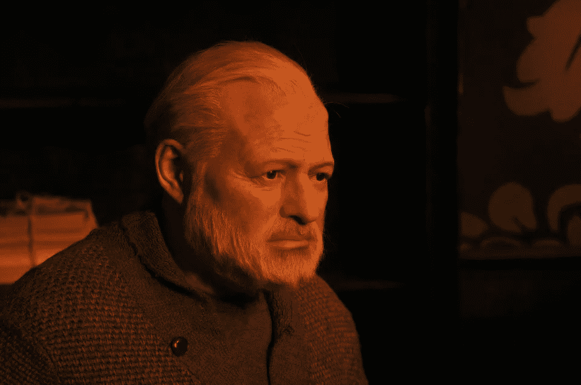

# 你不需要把你的东西放在一起才能写作

> 原文：<https://medium.com/swlh/you-dont-have-to-have-your-shit-together-to-write-f17f8aee6485>

它甚至可能是相反的。

Well known alcoholic Ernest Hemingway. Pixabay.com

我发现有些作家有点无聊，他们总是写些关于一起拉屎的事情。

我更喜欢深刻多汁的情感作家谁没有他们的屎在一起，谁愿意承认这一点。

我更喜欢表现脆弱的作家，尤其是在写回忆录的时候。几乎是必须的。