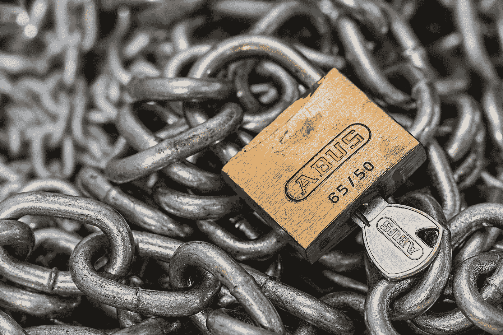

# 你没有隐私权

> 原文：<https://medium.com/swlh/you-have-no-right-to-privacy-b90e9c5b310>

这是脸书说的。脸书拥有你的数据，并利用其权力和影响力来侵犯用户隐私。我们应该非常担心。

Image by [Steve Buissinne](https://pixabay.com/users/stevepb-282134/?utm_source=link-attribution&utm_medium=referral&utm_campaign=image&utm_content=597495) from [Pixabay](https://pixabay.com/?utm_source=link-attribution&utm_medium=referral&utm_campaign=image&utm_content=597495)

# 隐私是一种权利，直到它不再是

对比是显著的:马克·扎克伯格宣称隐私是脸书愿景的核心和基本部分，但是我们现在发现它的律师 T2 声明 T3…