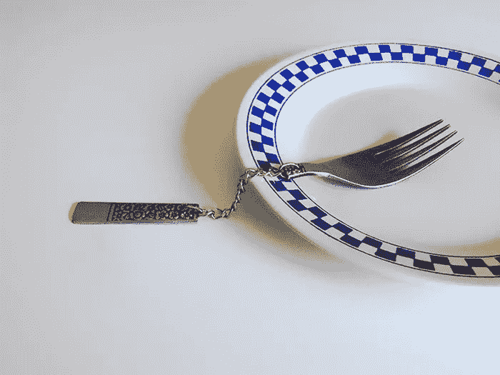

# 你的想法没有因为缺钱或者没有能力执行而失败

> 原文：<https://medium.com/swlh/you-idea-didnt-fail-because-of-lack-of-money-or-your-inability-to-execute-it-1a9e2791836b>

## 破坏的是你的确认过程。

A perfectly useless fork

好主意和坏主意有什么区别？有时候几乎说不出来。有人会为了钱让完全陌生的人在他们家过夜吗？有人会相信一个不认识的人去接他们，带他们去想去的地方吗？那些(现已整合的)想法刚刚公之于众...虽然每个人都希望自己的想法受人喜爱，但只有一小部分值得执行。

> 为了了解一个想法是否有机会成功，它需要被验证。

# 保持精益:在建立之前关注客户

*“人生苦短，没时间去造没人想要的东西。”阿什·莫利亚*

几乎一半的创业公司失败是因为他们没有解决实际的市场需求。几年前，我有了一个惊人的想法，所以我回到家里，开始建造一个原型。我只专注于建筑，然后我出去销售，尽管几乎每个人都喜欢这个概念和它的工作方式，但没有人愿意为此付钱。这是一种“有点好拥有”的产品:他们就是看不到它的价值。

> *没有一家伟大的公司是建立在拥有特色之上的。*

正如史蒂夫·布兰克所说，“创业公司不是大公司的小版本，它们需要自己的一套流程和工具才能成功”，所以遵循他的方法来提高成功率:

**客户开发方法**

*   **到外面去！你的大楼里没有事实。**
    你需要尽可能多的和用户交流才能前进，即使这意味着要做不可扩展的事情。
*   **没有一项业务是建立在美好的特性之上的。** 最重要的是通过解决客户最大的挣扎、挑战和挫折，让他们更加成功。好东西不会带来大生意。
*   没有一个商业计划能在与市场的第一次接触中存活下来。
    不要花太多时间写你的商业模型，花 5 分钟把你的想法放在商业模型画布上，然后去测试它们。

把建筑和用户研究结合起来。没有反馈就是不好的反馈。拥抱与你客户的每一次互动，这样你就向成功敞开了大门(或者按时放弃项目！)
保持正轨:开发产品，与用户对话；不要被其他事情缠住，你不会想把时间花在那些无足轻重的事情上。

> 是什么让你的解决方案对他人有价值？

# 验证你的想法

当涉及到风险更大的新商业创意、产品和概念时，创意验证至关重要。验证它的最佳方式取决于特定想法的性质。创意验证的目的是在构建和发布最终产品之前，将创意暴露给现实世界的实用性。

通过验证一个想法，你就降低了风险，加快了市场上创造价值的服务的交付，并使成本最小化。在投入大量时间和资源开发一个想法之前，应该对其进行验证，以避免构建和推出一个没有人想要或不愿意花钱购买的产品或概念。

在某些情况下，一个想法可以被验证为:

*   确认时机是否正确
*   确认你能够足够高效地销售和交付解决方案:如果有需求，有人愿意为你提供的服务级别付费吗？

# 验证你想法的步骤

尽管有多种不同的方法来验证和构思，但整个验证过程非常简单明了:

**明确目标**
你想学什么？
你是在验证产品、市场还是问题？

**发展假设**
你的假设是什么？怎样才算是成功？

**实验**
你打算如何检验你的想法？
[打造你的 MVP](/swlh/dont-fall-in-love-with-your-prototype-a6af8572fd53)

**验证**
你的假设成立吗？

请记住，验证最终是为了测试你的假设！