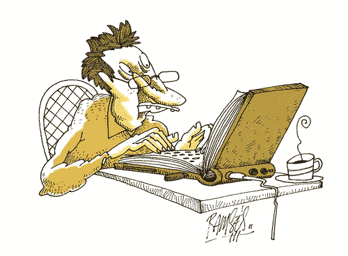

# 你知道你是一个作家，如果…

> 原文：<https://medium.com/swlh/you-know-youre-a-writer-if-f81d74d55cc4>

copyright ramses hill

1.  你意识到你很久没有洗澡了(也许几天？)但是你太沉迷于你正在做的事情，而没有努力去体验淋浴。我的意思是有点臭有什么不好？你告诉自己。
2.  无论你走到哪里，你遇到的每个人都会想，“现在*那个*可能会是一个伟大的故事！”
3.  没有什么比坐下来写作更像家或者更舒服的了…