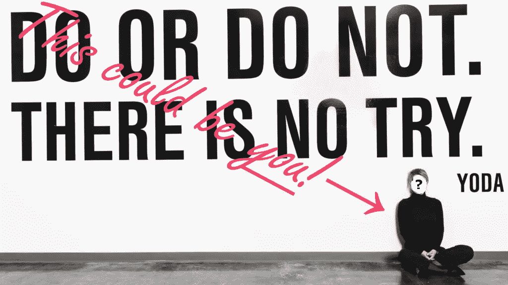

# 你看起来像 Theranos 材料！

> 原文：<https://medium.com/swlh/you-look-like-theranos-material-6738ebf6ad08>

## 如何像伊丽莎白·霍姆斯一样领导

你准备好登上《福布斯》杂志和《T2》杂志的封面了吗？由你所在行业和国家的领导人庆祝？价值*数十亿*美元？那么系好安全带，**你即将创立 Theranos，成为伊丽莎白·霍姆斯**。

> 把它想成是风格胜于实质

建立一家改变世界的公司并没有你想象的那么难。正如你将要看到的，你真的不需要任何“改变世界”的东西。你需要的是一种强有力的领导风格。事实上，你拥有的产品越少，你就越需要表现得像你一样。把它想成是风格胜于实质。

但是不用担心！要成为伊丽莎白·霍姆斯并创建 Theranos，在你与前国务卿共进感恩节晚餐之前，有 3 个大步骤。

# 首先，创造一个个人神话

哈佛大学领导、组织和公民社会教授 Marshall Ganz 说，每个领导者都应该有一个自己的故事——为什么你会被带到你所做的工作中。

**这是一个很好的建议，你需要遵循**。故事是让我们成为人类的一部分，也是非常强大的工具。他们可以在群体中创造一种明确的目标感。这就是为什么胜利的象征在团队空间如此受欢迎——它们有助于讲述团队的故事。这也是为什么《彻底坦白》的作者金·斯科特建议让团队成员把他们目前的角色视为他们个人故事的一部分。这样做会给你的团队成员一种目标感。

因此，作为创始人兼首席执行官，你的故事对整个公司都很重要，因为公司是根据你的愿景打造的。

不幸的是，如果你在年仅 19 岁的时候创办了一家公司，没有多少现实世界或职业经验，你可能很难想出这样的故事。

没问题！因为你是伊丽莎白·霍姆斯，你可以用你并不真正了解的叔叔的悲惨死亡作为你对医学测试感兴趣的原因。如果不是真的也不用担心。

还有，假装声音低沉。

(如果你不喜欢做这些事情，坏消息是:事情会变得更奇怪。)

# 接下来，创造一个共同的错觉

在创作(或编造)了一个“自我的故事”之后，甘兹建议继续创作一个“我们的故事”和一个“现在的故事”

因为你是伊丽莎白·霍姆斯，所以你不太担心“我们”——这听起来危险地接近于承认员工是人。

(在阅读约翰·卡瑞鲁的*恶感*及其所有内幕报道，以及在卡瑞鲁的[最初曝光](https://www.wsj.com/articles/theranos-has-struggled-with-blood-tests-1444881901)之前写的几十篇关于 Theranos 的赞美文章时，我找不到任何证据表明福尔摩斯将她的团队*视为一个团队*。其实正好相反……)

**但是你现在对***很感兴趣。现在是你改变世界的时候了！或者说，反正就是这么回事；).不过这对你来说确实有点棘手，因为你必须为你的大故事展示的只是一个稍微修改过的[胶水包装机器人](http://nautil.us/issue/60/searches/does-theranos-mark-the-peak-of-the-silicon-valley-bubble)。*

*这就是为什么你需要加倍你的野心和炒作。你正在用真正重大的技术改变世界。*

*用[强有力的外部验证](https://www.theverge.com/2016/5/25/11776018/theranos-walgreens-blood-testing-partnership-validation)来支持这种思维模式，同时忽略真正为产品工作的人。*

*比如*恶灵*第 143 页的这个场景:*

> *谈话最终又回到了此时此地和 Theranos。托尼(首席工程师)和伊恩(高级化学家)一样，不再受到伊丽莎白的青睐，并被排除在微型实验室的开发之外，他提出了一个想法，即该公司可能只是伊丽莎白和桑尼浪漫的载体，他们所做的工作都不重要。*
> 
> *伊恩点点头。“这是一个双叶，”他说。*
> 
> *托尼不懂法语，所以他去字典里查这个表达。他觉得这个定义很贴切:“在两个彼此联系紧密的人身上出现相同或相似的妄想。”*

*既然你是伊丽莎白·霍姆斯，这就引出了经营 Theranos 这样的公司的最后一个方面——不幸的是，这也是必须的——为你工作的人。*

# *最后，无情地管理*

*既然你是伊丽莎白·霍姆斯，而且你经营 Theranos，那应该足以成为亿万富翁了。事实也的确如此。但是你仍然需要一些其他的人来充实这个团队，比如科学家和工程师，他们会不知疲倦地努力让你的梦想成为现实。*

*好消息是你可以对他们非常糟糕。*

*首先，雇佣一个鲁莽的反社会者来处理大多数人才管理职责。桑尼·巴尔瓦尼，一个你正在秘密约会的网络百万富翁是完美的人选。让他处理以下大部分管理领域。*

## *扼杀交流*

*忘记部门内部沟通可以刺激创新的想法。运行 Theranos 并不涉及很多创新。这确实需要隐藏任何缺失。*

*所以没有即时消息或跨团队聊天。仔细观察所有公司的电脑是如何被使用的(你以后肯定会用它来勒索)，如果有人*在周末*发明了一些很棒的东西，试着强迫他[给你它的专利](https://books.google.com.vn/books?id=CcJFDwAAQBAJ&pg=PT125&lpg=PT125&dq=theranos+bicycle+light+patent&source=bl&ots=JiA015xNOE&sig=ACfU3U3y18r15T0ZYhS54DR5va4BZRQ91Q&hl=en&sa=X&ved=2ahUKEwjE7Lj75IDhAhVExLwKHY4iCBUQ6AEwAnoECAgQAQ#v=onepage&q=theranos%20bicycle%20light%20patent&f=false)。*

**

## *奇怪的团队仪式*

*就像故事一样，仪式对任何领导者来说都是很好的工具。他们强化你的团队文化，把每个人团结在一起。在皮克斯，他们有很多实地考察。既然你表面上是一家血液公司，大型万圣节派对是有意义的，也是可爱的。*

*但是仪式需要真正抓住你的文化的精髓，*包括所有的缺点。**

*例如，如果你的文化中有一个愤怒的人，经常会因为轻微的违规行为而解雇人，或者大声反对危险的情况(确实如此)，那么一个更合适的仪式可能会包括类似这样的事情( *Bad Blood* pg 105):*

> *Theranos 的安全团队负责人脸上带着恶作剧的表情走了下来，手里藏着一个徽章。一看到他，约翰和后勤团队就会兴奋地聚集在一起，知道将要发生什么。当(安全负责人)走近时，他会慢慢旋转项链上的徽章，露出正面的脸，引起惊讶的喘息。这是桑妮的最新受害者。*

*(**哪个*是你们公司的一种仪式，不管你有没有意识到****。如果你不提供它们，你的团队*将*创建他们自己的团队文化的精确工件。)**

## **活跃的校友网络**

**最后，这么多人从 Theranos“毕业”,你需要让每个人都知道你不会忘记他们，从而完善你团队的文化。**

**例如，网飞是一个“很棒的地方”那里的经理试图为离职员工的下一个职位做准备。前谷歌员工被称为 Xooglers，他们一起做各种各样的事情。**

**但是因为你经营 Theranos，你会以不同的方式培养你的校友网络。主要是通过诉讼威胁、实际诉讼、跟踪和[国内最有权势的律师之一实施的一般恐吓](https://www.businessinsider.com/lengths-theranos-went-to-contain-the-wall-street-journals-investigation-2018-5)。**

**嘿，只要你保持联系，对吗？**

# **不，但是说真的**

**在霍姆斯和巴尔瓦尼的统治下，Theranos 发生的是虐待。**

**你可以想象，当折磨你的人会见了总统、副总统，被国家媒体庆祝，*成了亿万富翁*等等，在这样的条件下工作是多么令人迷惑。压力驱使 Theranos 的一名员工，即上文第一段引用的化学家 Ian，结束了自己的生命(当时公司并不承认，只是让一名律师给他的遗孀发电子邮件索要公司财产)。**

**这里的教训是，员工虐待无关紧要。对于那些本可以检查福尔摩斯权力的人来说，我们崇拜领袖的文化压倒了人类尊严的重要性。**

**可能是贪婪蒙蔽了人。也有可能霍姆斯的行为与其他硅谷英雄没有太大区别。**

**但无论如何，尽管媒体对霍姆斯和 Theranos 的关注大多与欺诈和本应防止欺诈的公司治理有关，但我认为我们忽略了对 99.99%的人来说更紧迫的东西:**电力公司领导人对其员工的控制**。**

**正如 Revolut 的[滥用被关于](https://www.wired.co.uk/article/revolut-trade-unions-labour-fintech-politics-storonsky)[监管合规](https://www.ft.com/content/de48e654-432e-11e9-a965-23d669740bfb)的报道所掩盖，Theranos 的这个更大的问题也没有被提及。解决办法是毫无歉意地要求更好的老板，让领导力——因为它与*人相关—* 成为就业和新闻报道的核心考虑因素。**

**如果排队宠爱福尔摩斯和 Theranos 的许多主要记者中有任何一个询问她逼得自杀的化学家或反社会的总统，那么另一个关于 Theranos 的真实故事可能会更快出现。**

**感谢您的阅读。我为即将发布的团队文化应用 Sprynkl 研究团队文化。**

## **抓住他们！**

**我分享我在网上找到的东西，并写在半月刊上。**【**[**【订阅】每隔一周在你的收件箱里获取基于实践和心理学的领导技巧**](https://www.sprynkl.io/blog/?subscribe=&utm_source=medium&utm_medium=article&utm_campaign=theranos) 。**

****

## **这篇文章发表在 [The Startup](https://medium.com/swlh) 上，这是 Medium 最大的创业刊物，拥有+435，678 名读者。**

## **订阅接收[我们的头条新闻](https://growthsupply.com/the-startup-newsletter/)。**

****