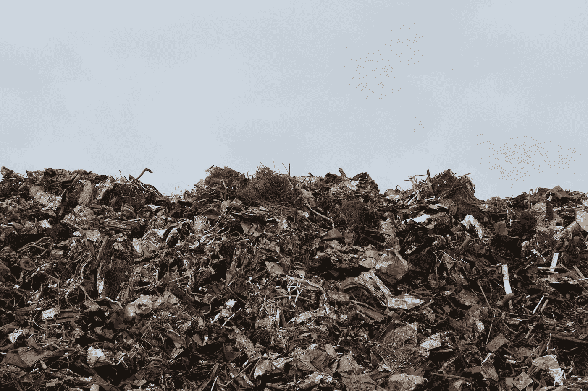

# 你可能想放下那个可生物降解的叉子

> 原文：<https://medium.com/swlh/you-might-want-to-put-that-biodegradable-fork-down-c78f6109e6b6>

Photo by [Emmet](https://www.pexels.com/@emmet-35167?utm_content=attributionCopyText&utm_medium=referral&utm_source=pexels) from [Pexels](https://www.pexels.com/photo/scrap-metal-trash-litter-scrapyard-128421/?utm_content=attributionCopyText&utm_medium=referral&utm_source=pexels)

## 垃圾填埋场和生物降解材料产业的真相

你知道吗，一片莴苣在垃圾填埋场需要长达 30 年的时间才能分解？在 1973 年由亚利桑那大学委托的一个[项目](https://www.encyclopedia.com/environment/encyclopedias-almanacs-transcripts-and-maps/garbage-project)中，人们发现热狗、玉米棒和葡萄在 25 年后完好无损地出土了。