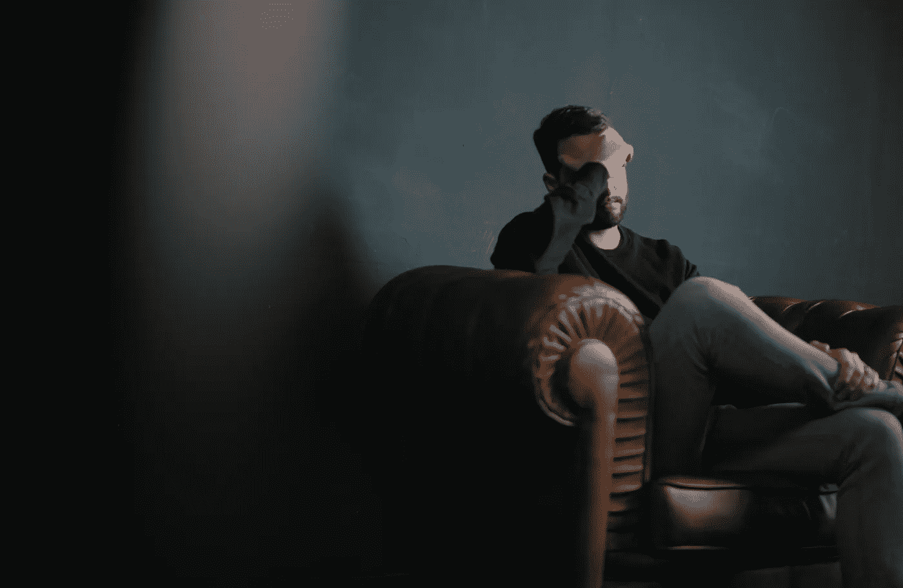

# 你需要警惕你的心理健康嫉妒

> 原文：<https://medium.com/swlh/you-need-to-guard-your-mental-health-jealousy-ba3ecb49f141>

Photo by [Nik Shuliahin](https://unsplash.com/@tjump?utm_source=unsplash&utm_medium=referral&utm_content=creditCopyText) on [Unsplash](https://unsplash.com/search/photos/sad-man?utm_source=unsplash&utm_medium=referral&utm_content=creditCopyText)

如果有什么东西是我们的千禧一代无情地扫到了地毯下，充耳不闻，视而不见，那就是忽视心理健康的潜在风险。虽然许多人继续一笑置之，希望它会过去，但它继续变得根深蒂固，并给那些受害者带来了许多难以言表的痛苦。