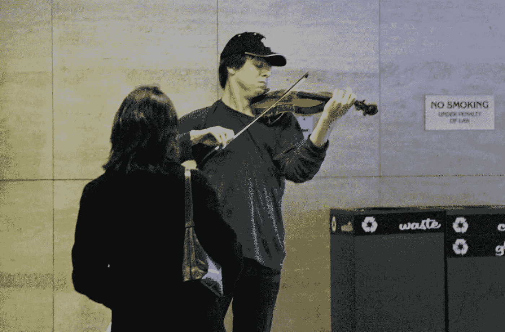

# 你需要放慢速度来变得更加成功

> 原文：<https://medium.com/swlh/you-need-to-slow-things-down-to-become-more-successful-c643820aadbd>

## 街头音乐家能教会你什么是生活和商业

Image from an article on Washington Post — [https://www.washingtonpost.com/news/style/wp/2014/10/14/gene-weingarten-setting-the-record-straight-on-the-joshua-bell-experiment/?noredirect=on&utm_term=.f68aacac5454](https://www.washingtonpost.com/news/style/wp/2014/10/14/gene-weingarten-setting-the-record-straight-on-the-joshua-bell-experiment/?noredirect=on&utm_term=.f68aacac5454)

我们如此匆忙地去做我们的工作，去实现我们的目标，以至于我们有时会忘记欣赏我们周围的美景。2012 年，乔舒亚·贝尔在 DC 做了一个实验。第二天，在一场最便宜的票价为 100 美元的音乐会后，他同意带着他价值 350 万美元的小提琴去地铁站免费表演 45 分钟。从他身边经过的 1000 人中，只有 7 个人停下来听他说话，只有一个人认出了他。这是 0.7%的比率。其余的人都不介意他在地铁站里玩。

为什么我要告诉你乔舒亚·贝尔实验？今天，当我在镇上做一些工作时，我看见一个老人在拉小提琴。这个人比约书亚更成功，许多人给他钱，花时间欣赏他的音乐。我上传了一个 1 分钟的 Youtube 短片，为了让你看看这个人对他的工作有多热情。尽管冰从后面的一棵树上落下来，他还是尽了最大努力表演，没有分心。

# 现在，你能从乔舒亚·贝尔或其他街头艺术家身上学到什么？

**1。放慢脚步。我知道你很忙。我知道你正在努力让你的事业更上一层楼，但有时当你花一分钟的时间停下来欣赏一朵花，或者像我今天一样听 2-3 首小提琴街头艺术家的歌曲，你会给自己充电，更愿意去为你的梦想奋斗，实现你的目标。此外，如果你每天的清单上有超过 5-7 个真正重要的目标，你需要开始修整这个清单。委派一些工作或者只是开始更频繁地说“不”。**

如果你想变得更有效率，去读一读我的关于最简单的问题的文章，你可以用它来减少你的待办事项清单并实现更多:

 [## 你能用一个问题变得更有效率吗？

### 通过提高生产力来发展您的业务

medium.com](/side-hustle/improve-your-small-business-productivity-4b02d560b662) 

**2。把激情投入到你做的每一件事情中……**我今天遇到的约书亚和小提琴手都在他们的表演中投入了激情。他们喜欢拉小提琴。他们并不在乎别人是否听他们的。当你有这种态度时，你会吸引与你有共鸣的人。无论事情变得多么艰难，你都不会放弃。这不是你不得不做的事情，这是你做的事情，因为你全身心地享受它。学会享受这个过程，而不是只关注成功。

> 成功就像地平线…无论你走得多快，你都无法达到。只要回头看看你已经走了多远…

**3。只对尽力而为感兴趣…** 当约书亚在地铁站表演时，有 993 个人没有注意到他。我今天遇到的这位艺术家更成功地将街头行人转化为听众，但仍有许多人只是路过而没有注意到。当你成为一名企业家或小企业主时，会有很多人与你擦肩而过，却没有注意到你在做什么。你的工作仅仅是寻找那些愿意和你一起工作的人，而不是太关注那些对你的产品或服务不感兴趣的人。

**4。定位非常重要…** 当约书亚在地铁站里拉小提琴时，人们把他视为一个破产的街头音乐家，他表演是为了有东西吃。前一天晚上，当他在一个大礼堂演出时，他让人们花 100 美元买了一张票。定位在商业中非常关键。当你只关注那些寻找便宜货的买家时，你会遇到很多问题。当你关注质量，吸引更少的优质客户时，你会发现你可能会赚更多的钱，问题也更少，因为当人们付钱时，他们会注意。

> 我已经演奏音乐超过 20 年了。我 14 岁开始玩。那些说我一夜成名的人……过去的 20 年你们都去了哪里？—兰迪·豪泽

**5。哪里的人更愿意和你互动？我今天见到的艺术家和乔舒亚·贝尔有很大的不同。约书亚在地铁站表演，那里的人们总是匆忙赶下一班火车。我今天看到的艺术家在车站外表演，在那里人们没有那么大的压力去赶火车。他还创造了一个更好的提议。随着背景中所有的冰融化和外面寒冷的天气，他能够在《觉醒》中获得更多的同情。你如何在你的业务中使用它？只需在你的网站上重做你的“关于”页面，或者在你的脸书页面上重做你的公司故事。告诉人们你是如何开始的，变得个性化，谈论一些你遇到的挑战，成为他们的朋友。人们喜欢从小企业购买商品，支持当地社区。**

👉 ***现在我想和你更私人一点…请你帮我点一下*** *👏* ***“也许在推特或脸书上与你的朋友分享这些。*** *这将帮助我激励更多的人永不放弃，继续他们的事业，不管他们在路上遇到什么样的障碍！*

## 👉你喜欢免费的礼物吗？我能帮你增加利润吗？

你是小企业主吗？我刚刚创建了一个指南，里面有很多练习和技巧，教你如何增加利润。什么时候开始从你的生意中获得更好的回报？在下面获取您的指南！👇👇👇

> [http://andreirebegea.com/iwanttogrowmyprofits/](http://andreirebegea.com/iwanttogrowmyprofits/)

## 这篇文章发表在[《创业](https://medium.com/swlh)》上，这是 Medium 最大的创业刊物，有+417，678 人关注。

## 订阅接收[我们的头条新闻](http://growthsupply.com/the-startup-newsletter/)。

