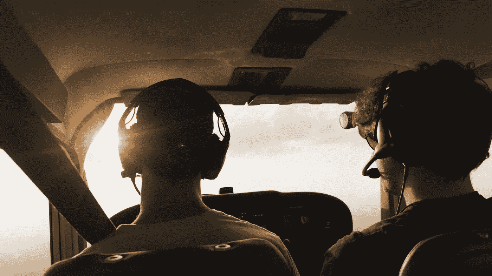

# 你需要抓住更多的机会

> 原文：<https://medium.com/swlh/you-need-to-take-more-chances-41311b09e9ca>

## 当站着不动时，学会迎接运动的挑战要舒服得多。

Photo by [Nicolas Jossi](https://unsplash.com/photos/ERUiIwjIf3Q?utm_source=unsplash&utm_medium=referral&utm_content=creditCopyText) on [Unsplash](https://unsplash.com/search/photos/compass?utm_source=unsplash&utm_medium=referral&utm_content=creditCopyText)

> “最大的风险是不冒任何风险。”
> 
> —马克·扎克伯格

没有刺激感的生活会有多无聊？甚至我们看的电影也描绘了这样一个想法，为了做…