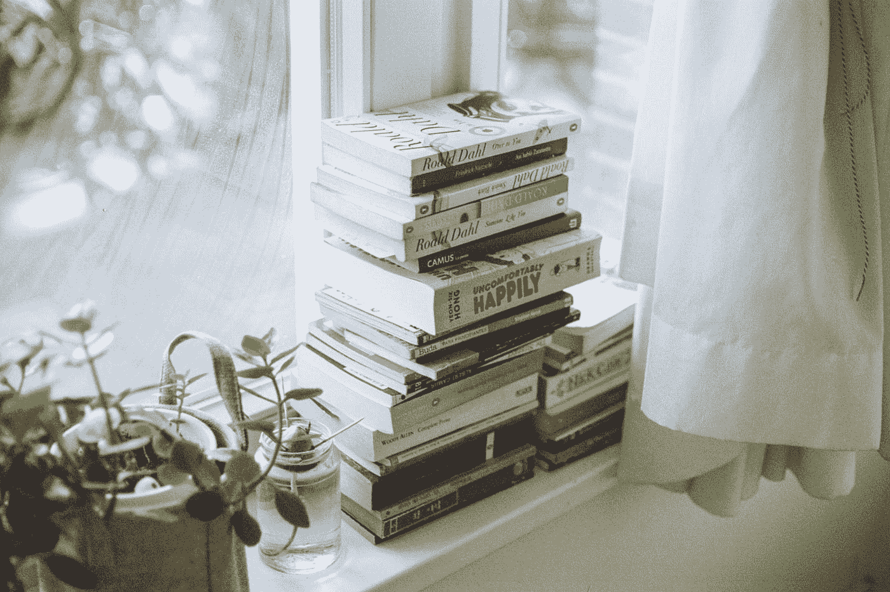

# 你需要理解我只有 20 岁，却读了 150 多本书

> 原文：<https://medium.com/swlh/you-need-to-understand-how-im-only-20-years-old-and-i-ve-read-more-than-150-books-92a456bc8ea4>

## 一个只读书的少年的自白

“assorted books on wooden table” by [Sharon McCutcheon](https://unsplash.com/@sharonmccutcheon?utm_source=medium&utm_medium=referral) on [Unsplash](https://unsplash.com?utm_source=medium&utm_medium=referral)

我是吃书的。我阅读一切可能的东西。我一直读到读不下去了。

我的朋友不知道我是怎么做到的。有时候我不知道我是怎么做到的。但事实是我已经做到了。我读了 150 本书，还不到 20 岁。

我 16 岁开始读书。在那个年纪，我发现了改变我一生的两个人。

> 一个是瑞恩·哈乐黛，另一个是 T2，蒂姆·费里斯。我一直想知道他们俩是如何做到一周读 2 到 3 本书的。

那对我来说太多了，我想做。我想和他们一样。

我是沃伦·巴菲特的合伙人查理·芒格的忠实信徒，他说:

> “5 年后，你的生活只会因为两件事而改变:你读的书和你认识的人。”

确实如此，这句话非常正确。

你的生活只会随着书而改变。

这就是我写下我的建议的原因，这样你就可以尽可能多的读书了:

“assorted-title book lot beside window” by [Florencia Viadana](https://unsplash.com/@florenciaviadana?utm_source=medium&utm_medium=referral) on [Unsplash](https://unsplash.com?utm_source=medium&utm_medium=referral)

# 随身携带一本书

> 阅读的最佳时刻是你最意想不到的时候。在飞机上，在地铁上，在公共汽车上，在银行的队列中。当你在广场等朋友的时候。

有几次你会有机会坐在客厅的沙发上开始阅读。

大部分阅读发生在那些小的死亡时间。

我的情况是，我在手机上下载了“kindle”。我通过我的智能手机阅读所有的书。

我知道很多人不喜欢它。但是它带来的好处太多了。

1.  我总是带着 10 多本书。我把它们放在口袋里等你打开应用程序。
2.  电子书比实体书便宜。
3.  我可以创建笔记，给重要的东西加下划线，然后导出到我的 Evernote。

最好的信息将永远伴随着我。Evernote 里都有。我可以编辑它，把它变成有价值的信息。

新项目开始时对我有帮助的信息。

# 尽量减少在社交网络中的曝光

社交网络对你的阅读没有好处。

> 比起阅读，看 instagram 或看 You Tube 视频总是更有诱惑力。

> 甚至，用媒介阅读一篇文章总是比真正阅读更有诱惑力。

这是我们必须处理的事情。

> 如果你真的想读书，你必须减少接触社交网络。

> 我是来关闭我的 Instagram 账户的。我花了一年多的时间没有 instagram，就是为了专心读书。

今天我有 Instagram。我每天都用它。我为了我的口味过度使用它。我觉得我应该减少在 Instagram 上的曝光。

问题是这次我不能关闭我的 Instagram，因为我用它来工作。

那是我现在正在处理的事情。

没有确定的公式来解决这个问题。

就我而言，我通过理解阅读的原因来解决这个问题。为什么我们应该每天读一点书。

> 有一个非常清楚的原因，你会更容易离开 Instagram 并开始阅读。

# 不要为网飞付钱

我不使用电视。我会变得懒惰，然后我什么都不会做。如果你问我《权力的游戏》的最后一章，我不知道。如果你问我是否看到了 T2 的最后一个进球。如果你问我是否看过最新的**道恩·强森**电影，我可能甚至不知道那是什么电影。

> 网飞不会给你带来任何好处。

> 你应该把这些银子用在其他更有用的事情上。你每年花在网飞上的 130 美元可以买 30 多本对你更有用的书。

# 阅读是一种需要

阅读必须成为你的主要困扰。

> 所以你不得不去图书馆看书，向你的朋友要书，下载非法书籍甚至在商店偷书。努力是值得的。

我将重复我以前说过的话:

> “必要的话偷书。”

目的证明手段是正当的。你需要阅读历史上最杰出的人物。

拿破仑在所有的战役中都带着成吨的书。沃伦·巴菲特说他每天阅读 500 页。如果你查看比尔·盖茨的博客，你会发现这位世界首富是如何推荐 200 多本书的。

像丘吉尔这样的人是伟大的读者。

甚至像马尔科姆·Ⅹ这样的人，在监狱里，他所做的一切就是读书。

如果他们有时间读书，为什么你没有？

# 明白读书没有捷径。

就像我说的:*拿起一本书，把它分成 7 部分，每天读那么多书。或者告诉你开始快速阅读课程。*

最终，这些都不起作用。在阅读中，没有捷径可走。

我知道，因为我两种都试过。

> 我已经开设了数百万个快速阅读课程，并且用 1000 种不同的方式划分了每天必须阅读的页数。

这些都没用。当我分割页面时，我没有完成每天的定额。当我快速阅读这些书时，我什么也不明白

# 读你喜欢的

最好读一些讲述他们醉酒经历的书，比如**“我希望塔克麦克斯的地狱里有啤酒”**

或者你读过教授诱惑的书，比如《尼尔·史特劳斯的游戏》。

什么都不读。

> 你每读一本书，下一本书就更容易读。

> 如果你开始读第一本哈利波特，你更有可能读完这 7 本书。

在书中，多米诺骨牌效应发生了，你从小事开始，然后你会把书当枕头，你会把书放在车里，甚至浴室里。

你会发现几个月后你会开始阅读哲学书籍，比如:**“查拉图斯特拉如是说尼采”**

# 为书籍创建自己的组织方法

一开始，我总是在网上研究一本书是好是坏。

这本书越老，我越有可能去读它。

> 古典书的贡献总是比新书大。

一旦我决定要读哪本书，我就会在 kindle 上购买。

一旦进入我的 kindle，每当我想阅读的时候，这本书就随时可供我使用。

> 当我阅读时，我总是强调重要的事情。有时候我会把书的所有页面都标出来😆😆😆😆😆

一旦我读完这本书，我已经强调了什么是重要的。我把它导出到我的 Evernote。

Evernote 会出现在我加下划线的每一个笔记中。

下一步是过滤这些笔记。

> 如果我回顾突出的事情，我总是会把没有意义的事情突出出来。我总是强调不值得做的事情。

这个想法是消除所有的垃圾，保留重要的笔记。以后可以复习的笔记。

我甚至改变了这本书的逻辑含义。

*   我从头到尾都记笔记。
*   我改变了我从课文中得到的某些单词。

> 我这样做是因为我想获得最大量的书本知识。

一旦我的 Evernote 更新了。我重复这个过程，并不断寻找更多的书来阅读。

# 制定你自己的规则

我的原则是:**只买有价值的书。**

> 看完一本好书，一般都会买。我把它买下来放在我的图书馆里。我把它们买下来，以便下次有机会再读一遍。每次需要咨询什么的时候，我都会买下来放在手边。

或者规则如:**“一次只看一本书”。**

对我来说，我不能同时看书。每次我同时开始读书时，我都没有读完。因为在阅读的中间，我总是开始另一本书，所以我去了。

最后，3 个月过去了，我意识到我还有 6 本书没有写完。

我也有一条规则**不要阅读相同主题的书籍。**

> 如果我读一本关于商业的书，那么我下一本书会是一本小说。如果我读了一本市场营销的书，那么我下一本书会是关于哲学的。如果我读传记，那么我会读一本关于个人生产力的书。

“person holding a pile of books” by [Thought Catalog](https://unsplash.com/@thoughtcatalog?utm_source=medium&utm_medium=referral) on [Unsplash](https://unsplash.com?utm_source=medium&utm_medium=referral)

# 结论

那些是我曾经读了 150 多本书，但仍然是 20 岁的规则。

如果你在寻找一个快速公式，很抱歉让你失望了。

> 在更少的时间里读更多的书没有捷径。

如果你想读几本书，你必须每天坐下来读。

书不是自己看的。

# 如果你不知道读什么书，我推荐我精选的 23 本大家必读的书

 [## 如果你想成功，你需要阅读这 23 本书

### 我读过 150 多本书，这些是最好的

theascent.pub](https://theascent.pub/you-need-to-read-these-23-books-if-you-want-to-be-successful-52c0a4d13140) 

## 这篇文章发表在 [The Startup](https://medium.com/swlh) 上，这是 Medium 最大的创业刊物，拥有+430，678 名读者。

## 订阅接收[我们的头条](https://growthsupply.com/the-startup-newsletter/)。

