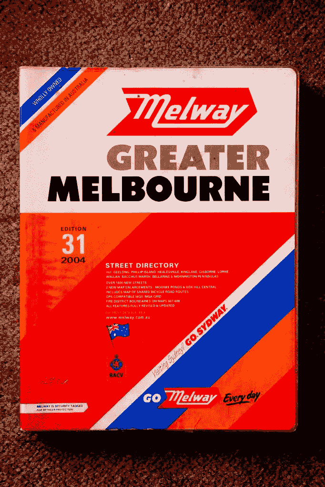
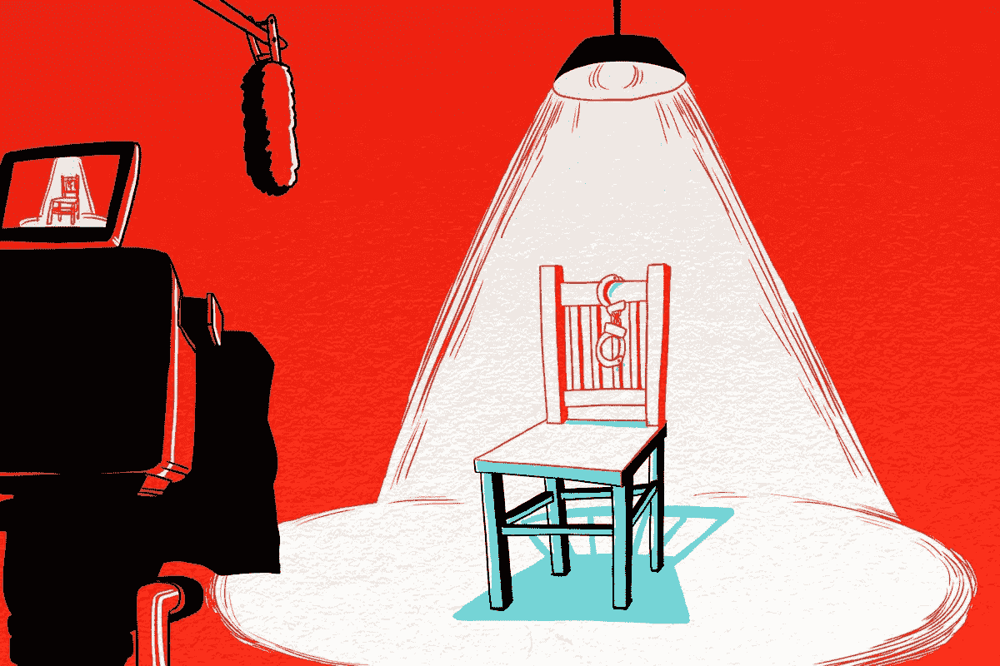
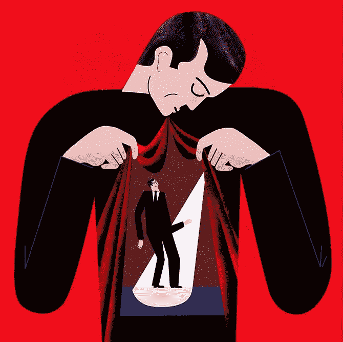

# 你需要忘记

> 原文：<https://medium.com/swlh/you-need-to-unlearn-24cbae86f132>

你可以沉迷于学习新技能，或者你可以做一些更聪明的事情。

你可以忘记那些没有用的东西。

你在学校学到的，或者十年前在工作中学到的，或者从你父母那里学到的，可能完全不相关。

> **过去发生的许多事情不再适用。有意识地接受这个事实，并为此做些什么，是非常强大的。**

这种挑战的一个很好的例子就是我们所说的梅尔韦。在我居住的墨尔本，几十年来我们有一本书，你可以花 30 美元买到，上面有每个郊区的每条街道。在全球定位系统出现之前，这本地图册是你出行的工具。

我在 2004 年买了我的第一本梅尔韦地图册。直到 2009 年我才有了一辆带 GPS 的车。所以从 2004 年到 2009 年，我一直在用同一本书的地图。我买这本书时，它很有用，因为它上面有每条街道。

购买这本地图册几年后，我去一个朋友的新家拜访他们。我迷路了，浪费了两个小时的时间。后来我发现他的街道不在地图上，因为我的梅尔韦已经过时了。

The exact books of maps I used to own.

我需要一张新地图，因为旧地图已经不能用了。我在 2011 年遇到了同样的问题，当时我的 2009 版地图软件把我带到了错误的目的地，因为它又一次过时了。

> 我们很多人都是这样生活的。我们用一个过时的 GPS 导航生活，然后想知道为什么我们会迷路。

## 这里有 4 种方法可以忘记:

# 1.总是怀疑你认为你知道的。

从一个“也许我错了”的地方开始怀疑，有助于你不断学习新的信息。

想想认为自己知道一些事情而完全错了的后果。

> 你可以通过始终怀疑你“认为”的出发点来避免灾难性的失败。

**人类的存在很大程度上是基于我们的感知，而这种感知有时会令人恐惧地偏离。**

太多的人认为我们什么都知道，这可能是如此多的痛苦和不必要的失败的原因。

# 2.打破自以为知道的习惯。

这是一个坏习惯，也是我们默认的操作模式。

我们总是基于我们认为我们首先知道的东西来行动。有用得多的习惯，总是先假设自己不知道。

这个习惯会迫使你寻找新的信息，并和其他可能给你带来改变的建议的人交谈。

你不是房间里最聪明的人，永远也不会是。

打破自以为知道的习惯，因为面对现实吧，你可能不知道。或者你的信息可能已经过时。

Image Credit: [The Ringer](https://www.theringer.com/)

# 3.坚持证明你今天相信的是真的。

怀疑你所知道的是一回事，但是坚持证明你所相信的仍然是正确的是一个更好的策略。

忘却是寻找新的信念和策略。例如，你可以相信你可以在 30 秒内跑完一英里，但是如果证据表明这是不可能的，那么你实际上是在试图完成一件既不可能又愚蠢的事情。

> 基于情感而不是证据来改变我们的想法太容易了。

当你抛弃旧的思维方式并用新的思维方式取代旧的思维方式时，你需要有可靠的证据。

# 4.如果这一切都失败了，就让它去吧。

前三步会告诉你很多。简单的事实是，在上述三个步骤之后，你的策略或信念可能是错误的。

如果是这样，那就随它去吧。不要对此情绪化，或者试图抓住你学到的不再正确的东西不放。

> 这不是正确与否的问题；而是要有一个切实可行的策略或信念。

# “我不知道”很酷。

我昨天用了这个短语。

有人问我建一个咖啡网站的想法。我已经很久没有造过了，所以我所知道的可能已经过时了。我告诉他们*我不知道*

那天晚些时候，LinkedIn 上有人问我，他们是否应该使用商业计划辞掉工作，开始咨询。我告诉他们‘我不知道。’

为什么？当我开始我的咨询业务时，我没有使用计划。事实上，我从来没有使用过商业计划，而是更喜欢做用户测试来验证一个想法，而不是基于我有限经验的计划。

> 我的信念是，事情变化如此之快，以至于大多数商业计划在完成之前就已经过时了。

说你不知道完全没问题。

# 你的旧观念才是可怕的。

我以前对世界的看法是，每个人都想从我这里偷东西，我必须尽可能地为自己赚钱。我以为生活就是适者生存。

想象一下，如果我仍然使用这个世界的模型，并且没有忘记它。

**我们不应该害怕改变或忘记我们所知道的；我们应该被学到的旧思想吓得魂不附体。**

信息唾手可得，所以我们都处于平等的竞争环境中。

区分我们中能够茁壮成长的人和不能茁壮成长的人的是我们的思想。你有没有给自己编程，让自己一遍又一遍地学习、遗忘、再学习？

> 有勇气承认自己错了或者需要重新学习一些东西，需要那些有自知之明并准备把自我放在一边的人。

Image Credit: [Stephanie Wunderlich](http://www.wunderlich-illustration.de/)

# 极简主义运动说对了一半。

获取更多信息或报名接受更多教育不是答案。

> 答案是:少即是多。
> 
> 算是吧。

答案就是在你的余生中不断重复减法和加法的习惯。

这就像不断更新你的内部软件，以确保你目前认为是正确的，拿走不再相关的东西，并加入以前未发现的新想法和策略。

真正的智慧贯穿于学习、忘却和再学习的实践中。

德里克·西弗斯让我看到了这个想法，这应该归功于他。

# 行动呼吁

如果你想提高你的工作效率，学习一些有价值的生活窍门，那就订阅我的私人邮件列表吧。你还将获得我的免费电子书，它将帮助你成为改变游戏规则的在线影响者。

[**马上点击这里订阅！**](http://timdenning.net/free-ebook)

## 这篇文章发表在 [The Startup](https://medium.com/swlh) 上，这是 Medium 最大的创业刊物，拥有+408，714 名读者。

## 订阅接收[我们的头条新闻](http://growthsupply.com/the-startup-newsletter/)。

