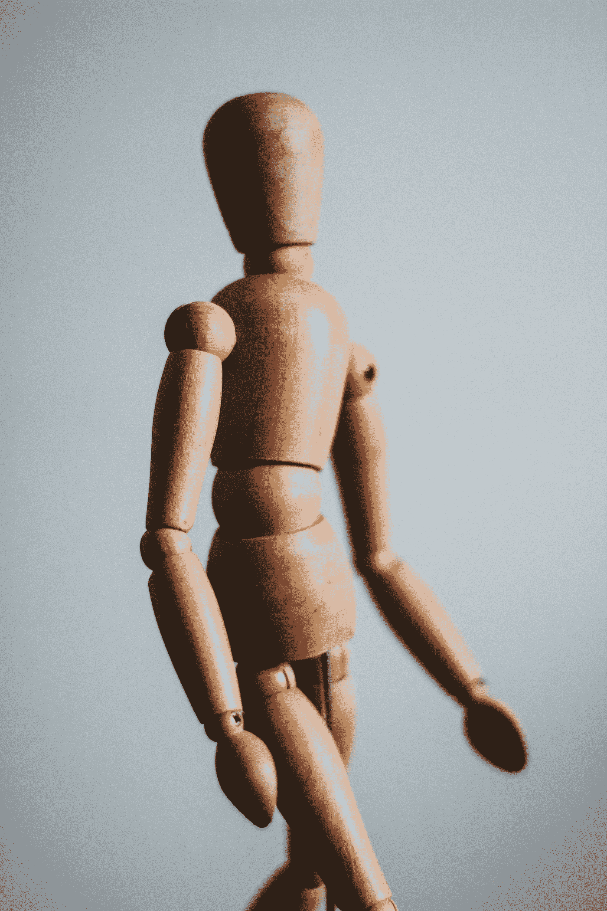

# 在这个世界上，你只能拥有一个身体——尊重它

> 原文：<https://medium.com/swlh/you-only-get-one-body-to-walk-this-earth-with-respect-it-b2782b6a9ef3>

羞辱身体是社会上的一种流行病。不要成为自己的受害者。

Photo by [Kira auf der Heide](https://unsplash.com/@kadh?utm_source=medium&utm_medium=referral) on [Unsplash](https://unsplash.com?utm_source=medium&utm_medium=referral)

我们无时无刻不在被完美的人的形象轰炸。完美柔滑的头发。完美无瑕的肌肤。苗条而匀称的体格。高，但不太高。匀称，但不要太弯曲。完美的工作。完美的关系。完美人生。

不胜枚举。

身体…