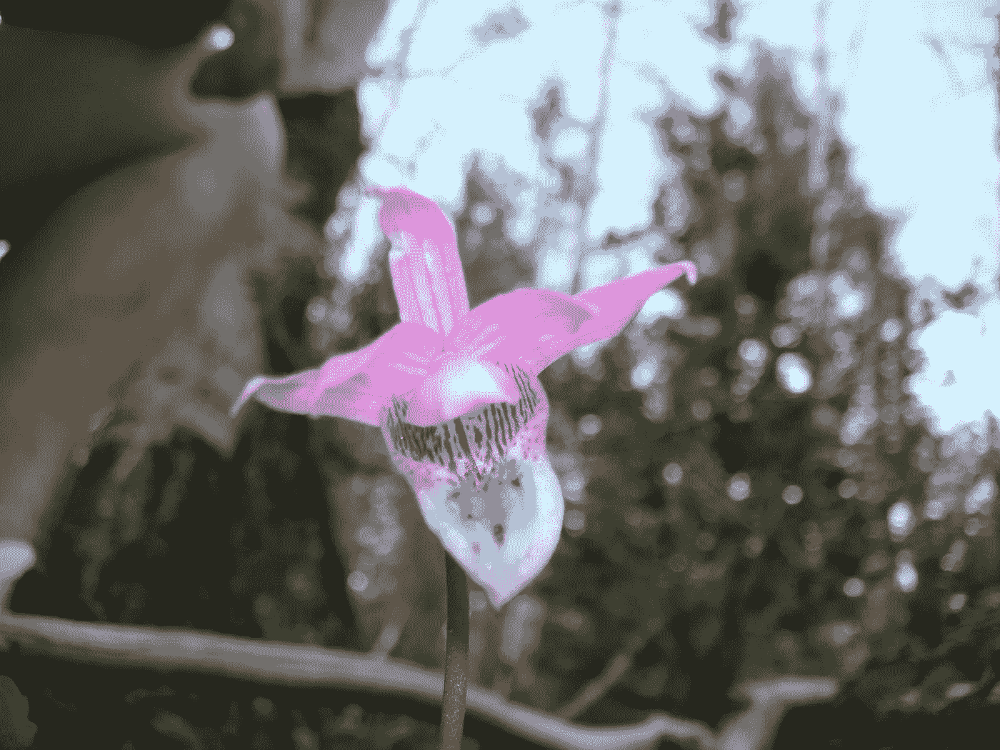

# 生活选择了你。你选择生活吗？

> 原文：<https://medium.com/swlh/you-really-do-have-a-purpose-in-life-ee1888b26d83>

对一个非基督徒来说，濒死体验如何重新定义了“上帝的选民”的真正含义。

Fairy Slipper/Calypso Orchid in the Rockies

**“你不能选择你的生活。它选择了你。”——保罗·柯艾略，*通奸***

“但我拣选了你，拣选了你，使你可以去结果子，就是常存的果子……”——约翰福音 15:16

回到今年五月，我经历了一场可怕的车祸。对方在一个路口从右后侧撞了我。我那辆笨重的 SUV 撞在人行道上，左右摇晃，不知怎么地就垂直着地了。

我的车报废了。在此之后，与保险公司争论，弄清楚我是否可以出售零件，等等。在接下来的几个星期里，这种经历仍然在我的骨骼和肌肉中嗡嗡作响，好像我所有的神经末梢都暴露在外了。

一些看到事故的人告诉我，我完全疯了。我不记得我是完全倒过来的，尽管我记得我车里的所有东西和我驾驶座边窗户的碎玻璃在我周围的空气中漂浮，就像在那些动作/悬疑电影中一样。

不管是什么情况，在某一点上，我和我信任的 2004 年特使一起在空中投掷。不可思议的是，当我们的四个轮胎都停下来的时候，除了一些被飞溅的玻璃碎片擦伤的小擦伤，我毫发无伤。

我不知道事故为什么会发生，也不知道是否有原因。我是那种总是在所有事情中寻找“为什么”的人。

就在这一切发生之前，在整个上午，我一直在感谢上帝，感谢我还有那辆车，感谢它多年来对我这么好，并祈祷它能支持我度过接下来的一两年，直到我买得起一辆新车。

当我开车的时候，我注意到我周围社区里破旧的汽车，感谢上帝，尽管我没有最新款的车，但我有一辆好的、可靠的车。现在，我没有车了，可能再也不会和我忠实的老朋友一起去公路旅行了。

是不是很讽刺？

关于事故的责任在谁，还没有作出决定——没有人被传讯。甚至一想到这可能是我的错，我就热泪盈眶。我记得我震惊地站在那里，整个混乱的压倒性现实击中了我，同时意识到我不再有车了(我只有责任保险)。

我最担心的是，我不再有车了，而且在接下来的一年里，我几乎不可能买得起新车。此时，我已泣不成声。协助我的警官傻笑，宣称我要让他哭了。他一直说，“嘿，只是辆车。所有这些都只是物质上的东西。你还活着，大家都没事。”

他是对的。我还活着。我还活着。我们都没事。似乎奇迹般地。

我记得几个小时后，当我把这件事告诉我的牧师兼朋友时，她的反应是:“好吧，如果你曾经怀疑你注定要在这里，你可以记住这段经历！感谢上帝有这么多天使保护你。”

我度过了艰难的一年。在过去的 13 个月里，我在自己的作品中无数次谈到了这个问题。我经历了一次又一次的失败，一次又一次的拒绝。有些时候，我怀疑自己是否能从绝望的黑洞中走出来。

像我们许多人一样，在这种时候，我经常怀疑上帝的存在。今年也不例外。在最黑暗的时刻，我们经常会问自己一个大家都很熟悉的问题，“好吧，如果上帝是爱，那他妈的!”！?"

虽然我是在基督教传统中长大的，但我的信仰之旅已经带我走过了许多其他宗教传统的风景。在我觉得基督教完全空虚，所有的灵性都没有目标的时候，来自其他宗教背景的智慧老师会突然出现，软化并重新打开我冷酷的心灵。

尽管如此，即使有几千年的精神传统教导说有一种从根本上来说是爱的源头能量，我仍然有日子认为这一切都是一派胡言。

尽管我对上帝的本质和存在有所怀疑，但在事故发生后，我无法摆脱这样一种感觉:我仍然在这里，没有被触及，这一定是有某种目的的。这种感觉不会离开我。这类似于我一生都有的一种感觉:我有工作要做。出于某种原因，我继续存在。

我不禁想到，在那令人恐惧的几秒钟里，在失去生命的瞬间，似乎是生命*选择了我*。随着现实如何显现的所有无限可能性，生活继续涌入我。它现在继续选择我。

当生活把你连根拔起，像沙漠中的风滚草一样把你扔来扔去，它往往会引发人生的重大问题。自然地，在我所有的愤怒中，我想了很多关于这些事情:上帝是什么？上帝会保护我吗？上帝爱我吗？上帝选择了我吗？

在一篇简短的文章中回答所有这些问题可能太多了，但我最感兴趣的是上帝选择我的问题。我想，首先，在我们了解上帝的本性之前，我们必须触及我们如何定义上帝的问题。

当我探索这些问题和概念时，我对上帝作为生命的力量有了一个最低限度的(并且不断发展的)理解。从某种意义上说，是的，一种渗透并赋予万物“气息”的能量之源。

因此，在我的事故中，问题出现了，“这个源头是否与它所产生的事物有一种互动的性质，以至于它会‘选择’让我活着？”

如果你在教堂方圆 50 英里内的任何地方长大，你可能一生中都听到过这样的话:上帝选择了你，上帝出于自己的神圣意愿创造了你，让你活在此时此地。

但是，这实际上意味着什么呢？

这是否意味着有一个神人，一个对它创造的事物和生命做出认知决定的神圣意识，就像人类会选择用什么颜色粉刷他们的房子或他们的一天做什么一样？这个上帝的定义假设了一个拟人化的层次，在我看来，这个层次过于狭隘，过于以人类为中心，是从人类的需要中产生的。

也许上帝是一种神圣的意识，能够有意地干预它所创造的世界。然而，我想知道，上帝/生命是否是一种力量，它不能不创造更多的生命，以其赋予生命的本质来体现自己。如果当我们谈论上帝“选择”我们时，我们实际上是在谈论生命仅仅按照它自己的“法则”或存在的自然参数行事，那会怎么样？( [Caroline Myss](https://www.myss.com/) 在[播客](https://soulfeed.libsyn.com/caroline-myss-get-back-to-your-nature-and-tune-in-to-divine-guidance)采访 [Shannon Algeo](https://www.shannonalgeo.com/) 时提出了这个建议。)

更直白地说，如果当我们使用我们选择的语言时，那实际上意味着上帝/生命，在上帝自己的本质内行动，通过我们以独特的方式显现，以便继续其展开的美丽艺术，会怎么样？并且，如果每一个特定的被创造的部分都是由一个生命选择的，以服务于一个独特的目的来维持它内部的平衡呢？

即使它看起来不太像是天上的一个拟人化的存在，用它拟人化的手，从字面上用粘土塑造了我们，这种神圣的偏好会使我们创造和选择的行为变得不那么美丽吗？

先不说生命倾泻到 ***我们的*人类** **生命**(而且，我不是说没有)……*多么惊险*！多么壮观！从这个意义上说，生命选择给予我们生命，作为整体平衡和艺术功能的内在部分，这是多么不可思议啊！

这让我想到，即使麻雀、松树和仙女鞋从生命中出现，在整体的营养和平衡中服务于它们的目的，也许这是基本的甚至是生物学的证据来支持我们人类——也是从生命的源泉中发出的——同样拥有我们完美、美丽和整体的目的和在其中的位置。

当我的牧师在听到我出事的消息后发出自信的感叹时，我其实有点震惊。我自己几乎没有想到这种可能性，也许那天我没有遇到死亡——生命继续在我体内流动——因为我的目的还没有实现。

当我给你写这封信的时候，我的朋友，我亲爱的行星兄弟姐妹，我意识到，如果你还活着，很可能你也还没有完成你的工作。那么，这对你来说意味着什么？为我们所有人？

我相信这意味着我们被设计成“遵从上帝的旨意”。在你停止阅读之前，听我说完。我知道这些话意味深长，让人想起一个极其令人讨厌的空中独裁者的形象。

“遵从上帝的旨意”并不意味着遵循一套规则或戒律。这意味着**深深倾听**(在[中是常见的圣经用法](https://www.biblestudytools.com/dictionary/obedience-obey/))我们每个人内心流动的生命智慧，这样我们就可以被带到我们命中注定要做的和困难的事情上，我们命中注定要分享这些事情。

这确实需要一些纪律和大量的放手。这是我们自我欲望的释放，是对每一件事物中****意志** **的臣服——活着的意志**！“拥有生命并充分享受它。”当我们致力于此时，我们不仅为我们自己的生活中出现的快乐感和目的感留出了空间，而且我们还为包括我们所有人在内的整体，一个伟大的生活提供了一种爱的、神圣的服务。**

**我的朋友，正如警官如此委婉地提醒我，我提醒你:*你还活着！*你是神性的显现，被“选择”成为生命每时每刻正在成为的一部分。事实上，生活继续选择你。**

**我相信理查德·勒尔在他的许多深刻的著作中肯定了这一点:**

***生活正在选择你* *现在……***

***现在……***

***现在……***

**亲爱的朋友，生活在选择你。问题是，你会选择生活吗？**