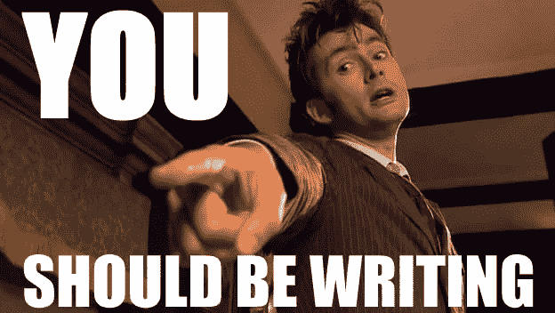

# 你不应该在写作

> 原文：<https://medium.com/swlh/you-should-nt-be-writing-8a3da5c44794>

你应该写作。

就模因而言，它可能是作家群体中出现最多的一种。“如果你正在读这篇文章，你应该在写作”，“停止滚动脸书，开始写作”，“如果你现在没有写作，你应该”是同一主题的常见变体。这些模因随处可见，从 Twitter 上的#写作社区标签到文学期刊和写作学校的脸书页面。

A meme of David Tennant. He is pointing towards the camera. Text on the image is saying, “You should be writing.” Via [writingonpoint.com](http://writingonpoint.com/post/productivity-baselines-writing-deadlines/)