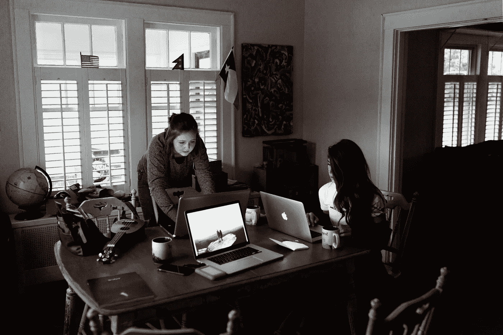

# 你应该在大学创业。是的你

> 原文：<https://medium.com/swlh/you-should-start-a-business-in-college-yes-you-fb903aa55b3b>

The starting point of many great companies — the kitchen table (Courtesy of Unsplash)

作为范德比尔特大学的一名学生，我有很多朋友对以创业作为职业道路感兴趣。怀疑和恐惧阻碍了他们。他们怀疑自己是否有足够的经验，害怕巨大的失败。我将分享一些我自己的故事，以及我是如何学会面对这两个人的。

我在高中时创办了我的第一家企业——一款针对棒球运动员的训练应用。我没有应用程序开发经验，但我认为尝试创办一家科技公司的风险极小。我仅仅带着一个想法——甚至不是来自我自己的想象——出发了。

作为一个即将成年的人，我毫不怀疑也不害怕。恰恰相反。我的高中要求每个学生都有一次顶点体验，所以这对我来说非常有意义。这是一个了解企业家精神真正是什么样的机会，一个深入科技世界的机会，一个在大学申请中炫耀自己独特经历的机会。我知道成功的几率很低，市场也无足轻重，这让冒险变得更加容易接受。

**发射失败**

花在第一个产品——我的第一家公司——上的时间需要一个陡峭的学习曲线。我遇到了意想不到的挑战，并对自己有了更多的了解——也就是说，我对棒球运动太不感兴趣，无法在这个领域成为一名企业家。我认识到组建和激励一个团队是非常困难的。我了解到技术开发通常需要比最初预测更多的时间、精力和资源。我还了解到，我对将一个想法塑造成有形的东西的过程充满热情。第一次失败的生意让我着迷。我知道我想成为一名企业家。

我被要求描述创业中最困难的部分。我的回答是，普遍真理很少。每个人都会面临不同的挑战。让你与众不同的是你如何应对这些挑战。对于每一次新的创业，我都面临着截然不同的障碍——技术的、基于市场的、财务的、人员的——从中学习。我在不断增加我的工具箱。

在我的棒球事业之后，我加入了一家食品服务公司的创始团队。他们已经开始确定产品市场，但规模很小，需要运营方面的帮助才能成长。由于没有餐饮服务运营的背景，我看到了商业计划和我个人成长的潜力。我花了几个月的时间来了解这个领域，设计流程，研究提高资本效率的供应品，并了解行业监管。基本上在每个转弯处，我都会遇到超出我经验范围的障碍。不舒服？是的。成长的沃土？又来了。最终，薪酬问题导致我决定与这位创始人分道扬镳。我以前从未就赔偿问题进行过谈判，也未能达成一个双赢的方案。巨大的教训。

虽然那次冒险没有成为我的重大突破，但我没有被吓住。我喜欢这种节奏——以极快的速度移动让我感觉充满活力。我喜欢追求自己梦想的自由，喜欢事情顺利时的成就感，喜欢事情不顺利时的学习机会。马克·扎克伯格说“最大的风险是不冒任何风险。”那么，下一步是什么？

Next 原来是和我爸一起创业的。大一之后的那个夏天，我们开始着手解决教育中的“问题”。在花了几个月的时间开发一款能让学生集中注意力于自己的目标和优势的技术应用之后，我们遇到了困难。你好恐惧和怀疑。我们变得沮丧，怀疑自己能否成功。

**怀疑的扩散**

大二返校的时候，大家都在争实习。在著名的咨询公司或投资银行任职可以向世界证明一个人的价值。我的许多同龄人都致力于找到一份好工作，积累经验，然后在准备好的时候创业。最小化风险和“公司化”是安全的。随着新的失败和怀疑爬进我的心灵，我决定也许创业毕竟太难了。也许我应该像其他人一样去实习。所以，我做了。

大二我是作为一个典型的学生度过的，限制了自己接触创业，找实习。尽管我开始寻找工作已经晚了，但我最终还是在一家大型咨询公司找到了一份工作。我度过了一个非凡的夏天，并获得了与有才华的人共事的丰富经验。这是我对企业界的介绍。我的团队在一次夏末的竞标中名列前 10%，我得到了一份梦寐以求的全职工作。我当时还是大学二年级的学生。认识到这个机会，我抓住了这个机会继续我的教育，同时提升我对公司的价值。

几个月来，我一直沉浸在这份工作及其所能提供的生活中。我会赚更多的钱，住在一个我梦想的城市。我已经取得了同龄人所定义的成功。但是当我去我的 LinkedIn 页面向世界宣布我的新身份时，我意识到我还没有准备好放弃我的“学生企业家”身份。我做不到。创业成了我的激情所在。所以，我放弃了这份工作。

从那以后，我又回到了创业公司，并准备在今年晚些时候推出我的第一个产品。我正把我生命中的时间用在我真正在乎的事情上，我不会用它来交换这个世界。这条信息是给像我一样的人们的，他们反抗并努力对抗这个世界对我们的期望，但是还没有勇气去挣脱。这需要时间、经验和指导，但我现在致力于追随我的激情。我希望这条信息能为你自己的旅程提供鼓励。

**企业神话**

我一直听到学生们着迷于创造价值、建立公司和解决他们热衷的问题的想法。不幸的是，他们让怀疑和恐惧战胜了他们的欲望。人们普遍认为，要想成功，你必须先让别人利用你的努力。这并不是说公司不会把你的一部分工作返还给你，但这肯定不是拥有你工作的股权所能提供的同等程度。例如，脸书每年从每个员工身上获得高达 200 万美元的收入和 75 万美元的利润。其他大型科技公司的员工人均收入也同样惊人:微软为 75 万美元，Alphabet 超过 130 万美元，Twitter 为 70 万美元[1]。

许多顶级公司的企业招聘界喜欢把自己定位为两年后创业生涯的起点。一旦进入这些公司，他们就会用声望、发展机会、高薪和缓慢授予的股票期权淹没年轻有为的员工。这些学生没有开始他们渴望的令人兴奋的创业生涯，而是慢慢融入了企业界，享受着生活方式的变化，直到创办公司不再可行。

这些公司滋生了这样一种信念，即他们队伍中的经验对以后的成功至关重要。最近，我和一个亲密的朋友进行了一次谈话，他就陷入了这种信念。这位朋友非常有才华，曾在美国一些顶级科技公司享有盛誉的实习经历。然而，他认为作为一个单独的开发人员，他无法开发出产品级的软件。然而，在只有两门计算机科学课和互联网的支持下，我开发出了一款软件产品，它让我们的早期用户和潜在投资者感到兴奋，并给我带来了比任何入门级职位都多的成就感。

这就是为什么我相信作为企业家积极自大的力量；你有能力填补市场空白。我想给你那种傲慢。在当今世界，传统公司每天都在成为初创公司的牺牲品，这些公司发展更快，思考更远，沟通更有效。你周围到处都有颠覆的机会，如果你发现没有人在利用，为什么你不能呢？你必须是受过哈佛或斯坦福教育的天才才能创办公司的神话是一个神话。创业和资本比以往任何时候都更容易获得，对于那些代表性不足的群体来说，这种机会正在乐观地增长。技术和信息经济意味着任何人都可以学会克服自己的弱点。任何人都可以在短短几分钟内建立一个网站。任何人都可以成为自主出版的作者或博客作者。不要让公司通过对你撒谎来利用你的年轻活力和努力工作。你可以成为一名企业家。

**企业家优势**

创业，不管是哪一种，都提供了学习的机会，远远超过了绝大多数典型的大学课程。我知道其他学生企业家正在学习社交媒体广告、网页设计、社区建设、加密货币等等。创业为学生提供了一个机会，让他们在充满实用技能的学习环境中真正探索自己的激情和兴趣。有了网上的资源，这也不需要花费太多，通过兼职或暑期实习就能轻松搞定。即使你的目标是产生现金，只要投资 500 美元，直运也是一个有利可图的选择。建立网站是另一个很好的选择，有了 Webflow 和 Google Firebase，你可以托管许多网站来创建一个投资组合，每月只需 15 美元。

虽然我还没有帮助数百万人改善他们的生活，但我可以自信地说，我从每次尝试中学到的东西比我在范德比尔特大学累积的学术经验还多。我已经了解了食品服务监管、脸书广告的基本知识、如何与人合作、定义公司和产品战略，以及最近如何使用一系列设计和编程工具来构建一个功能性的网络应用程序。相对于范德比尔特每年 64，654 美元的标价，我个人花费了大约 1，000 美元和无数小时，获得了相当大的学习投资回报率。

我希望我的故事和这篇关于大学创业的机会和风险的宣言能鼓励一些像我一样的学生大胆尝试。超过 1/3 的孵化器现在位于大学校园内。看看你的校园里有没有。

学生们，你们有能力在公司指导之外学习。你可以开发产品，发布博客，创建作品集。你的能力超乎你的想象。

请不要让别人告诉你你不能成为什么，想想你能成为什么。

如果你是一个有抱负的或正在创业的学生，我很乐意和你聊天！联系 Twitter @JonathanWSloan

这篇文章很大程度上来源于我在范德比尔特大学的经历，并感谢因陀罗·苏菲安的 [*如何让表现优异的大学毕业生落入“声望职业”陷阱*](/s/story/a-culture-of-prestige-98c8671ceade) ，激励我最终写出我的想法。

[1](根据[https://www . vox . com/2017/8/4/16090758/Facebook-Google-profit-per-employee-comparison-chart](https://www.vox.com/2017/8/4/16090758/facebook-google-profit-per-employee-comparison-chart))