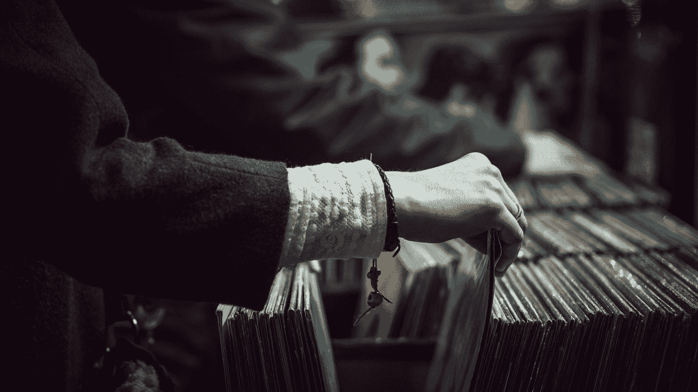

# 你以为跳蚤市场只是一堆垃圾？

> 原文：<https://medium.com/swlh/you-thought-flea-markets-are-just-piles-of-trash-ba1e5c8b01b8>

## 错了，它们是灵感的源泉——如果你正确对待它们的话。

Photo by [Edu Grande](https://unsplash.com/@edgr?utm_source=medium&utm_medium=referral) on [Unsplash](https://unsplash.com?utm_source=medium&utm_medium=referral)

W 无论你困在什么地方——T2——你的书，你的创业，一个在线课程——你都需要不时地 ***充实你的创意源泉*** 。许多创意者建议去散步、阅读或自由写作。但是我要冒险一试，把自己投入…