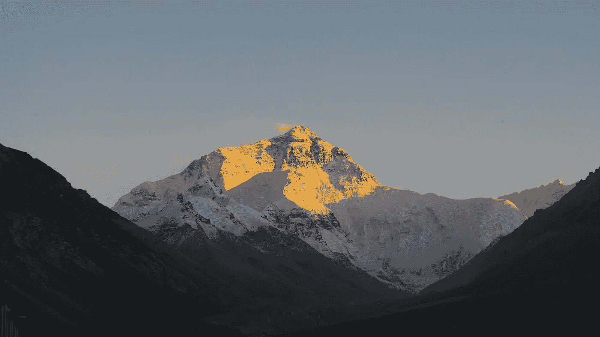

# 不冒险，你将一事无成

> 原文：<https://medium.com/swlh/you-wont-get-anywhere-without-taking-risks-2f0588f1ad05>

## 风险是生活的基本组成部分。

[Everest](https://pixabay.com/en/mountain-panorama-snow-landscape-3297562/)

风险是我们生活中固有的一部分。无论我们做什么，这都是一个因素。

吃食物有风险。

离开你的房子是危险的。

辞职去旅行一年是有风险的。