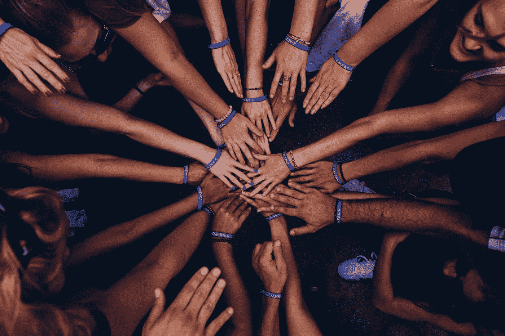

# 你的盟友并不完美

> 原文：<https://medium.com/swlh/your-allies-are-imperfect-1c84c60230cf>

## 认识到这一事实可以让联盟更加强大。

Photo by [Perry Grone](https://unsplash.com/@perrygrone?utm_source=unsplash&utm_medium=referral&utm_content=creditCopyText) on [Unsplash](https://unsplash.com/search/photos/community?utm_source=unsplash&utm_medium=referral&utm_content=creditCopyText)

在许多战斗中，人们需要一些盟友。这不是关于像二战同盟国或轴心国那样的历史联盟；这是关于离家更近的小战斗。诸如有色人种平等权利(POC)之类的斗争；女性；女同性恋者、双性恋者、男同性恋者、变性者和同性恋者…