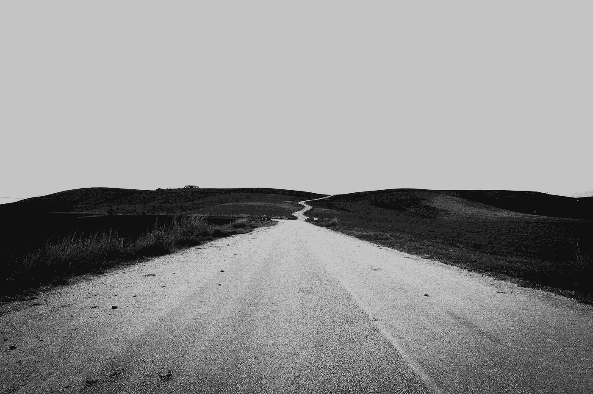

# 你最大的竞争对手什么也不是

> 原文：<https://medium.com/swlh/your-biggest-competition-is-nothing-a22f4a07b395>

【Seth Godin 如何重新框定我对我们应该如何定位我们的工作的想法

Photo by [davide ragusa](https://unsplash.com/@davideragusa?utm_source=medium&utm_medium=referral) on [Unsplash](https://unsplash.com?utm_source=medium&utm_medium=referral)

S eth 又来了。二十年来，他一直是我的虚拟导师之一。今天早上他在我的收件箱里放了一道闪电。[我指的是来自*塞斯博客*](https://seths.blog/2019/07/next-to-the-competition/) 的这一小块。

今天的帖子很短。五段。一个段落为我做了一切。