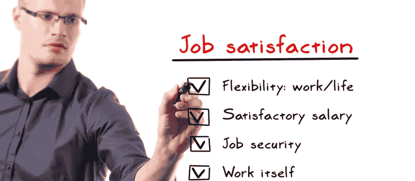

# 你的同事:工作中快乐的首要因素

> 原文：<https://medium.com/swlh/your-colleagues-the-1-factor-in-happiness-at-work-c05e97f47e52>

我们都有不同的方式来评估我们的职业满意度，对大多数人来说，这不仅仅是一件事。

有很多变量，可能每个变量对我们来说都有不同的重要性。有些人更受金钱的驱使，而有些人则更受使命/目的的驱使——但不管怎样，所有的因素都对我们起着一定的作用

这些年来，我自己的愿望一直在波动，但总的来说，我以前一直认为最重要的是**使命/目的**，然后是金钱和灵活性。

每个人都是不同的，随着时间的推移，我们会改变对我们的环境最重要的东西。

## **低估因素**

我在不断地评估什么让我在生活和工作中感到快乐。在过去的几年里，我自己和观察人们开始意识到，有一个因素比传统的目的、金钱、津贴和灵活性更重要。

> 这是一个经常被忽视但却至关重要的因素，它可以成就你的幸福，也可以毁掉你的幸福。和你一起工作的人。

我指的不仅仅是你的老板或经理(这也是重要的因素)，而是所有你每天与之打交道的人，和你一起“在战壕里”的人。

我们醒着的大部分时间都在工作，所以你在这几个小时的经历会极大地影响你的情绪。

你可以有一份有意义的工作，收入丰厚，但如果你没有高质量的人际关系、支持、友谊或社交，你不会满足很久。

## **生活就是关系**

人际关系是最重要的货币，它被证明可以改善你的健康和幸福。志趣相投的人之间有一种安全感，重要的是有一个可以聊天(闲聊)和分享想法、奇思妙想和情感的对象。

在处理工作和个人挑战时，优秀的队友可以成为啦啦队长、哭泣的肩膀和共鸣板。

我认为对大多数人来说，需要一段时间才能看清这一点，因为我们被鼓舞人心的信息蒙蔽了双眼，这些信息告诉我们应该做什么，我们应该最重视什么。

这并不意味着我在工作中会始终同意或与每个人意见一致，我需要/重视许多因素来满足我的职业生涯。但是在工作时间和我喜欢和尊重的人在一起对我的幸福至关重要。

Stewart Stanbra 是 CSUSA 和“追求”组织的创始人，他帮助有抱负的人追求抱负。请关注更多关于企业家精神、创业、领导力和自我保健的故事。非常感谢任何掌声！

*在推特上关注:*【https://twitter.com/Stew_Pursue】T2

## 这篇文章发表在[《创业](https://medium.com/swlh)》上，这是 Medium 最大的创业刊物，有+405，714 人关注。

## 在这里订阅接收[我们的头条新闻](http://growthsupply.com/the-startup-newsletter/)。

