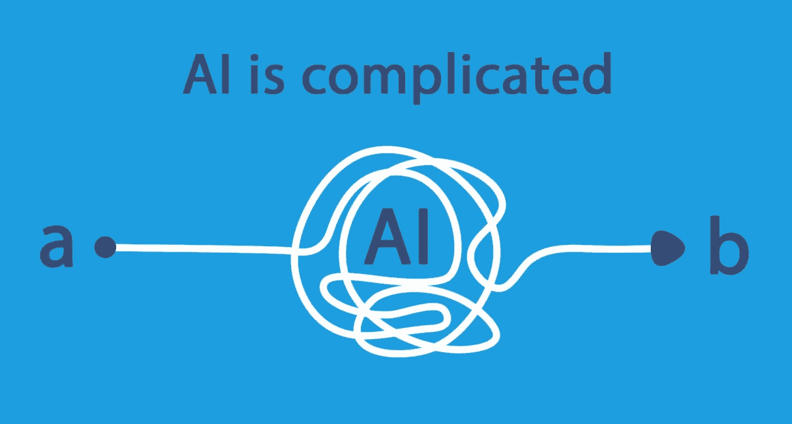

# 你的公司还没有为人工智能做好准备

> 原文：<https://medium.com/swlh/your-company-is-not-ready-for-ai-8e6324f0f67d>

人工智能(AI)和机器学习(ML)是新的性感科技术语，迅速成为创新的同义词。所有行业的专家都称之为技术的未来，真正的颠覆者。

这种兴奋和兴奋让每个高管都渴望跳上人工智能创新的浪潮，并尽可能快地驾驭它。问题是，他们对“冲浪”一窍不通！；-)