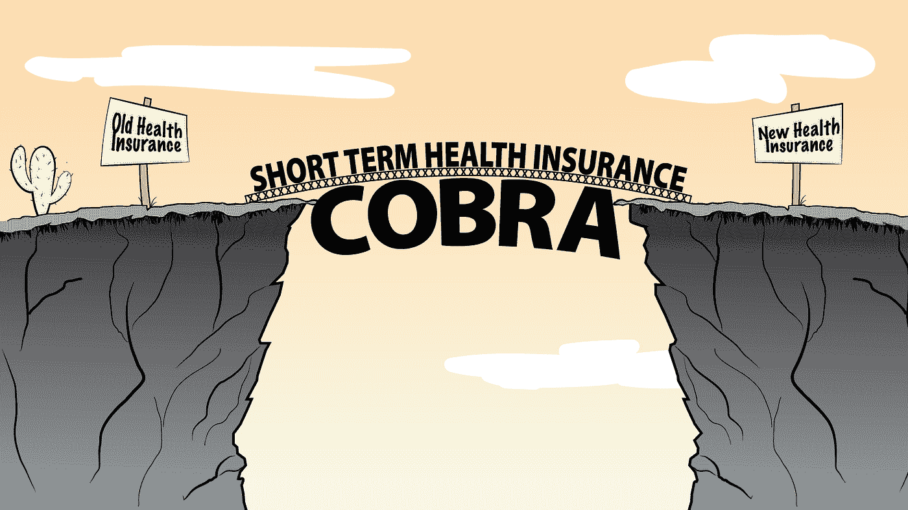

# 作为小企业主，您的医疗保健选择

> 原文：<https://medium.com/swlh/your-healthcare-options-as-a-small-business-owner-7e0c24639104>

作为一个小企业主，你已经有太多需要优先考虑的事情了，健康保险不需要成为额外的压力。当涉及到为你、你的家人、可能还有你的员工投保时，你有以下几种选择。

**平价医疗法案:**

通常被称为主要医疗保险，ACA 有几个组成部分。ACA 补贴由总年收入决定。没有保费补贴往往很贵。领取补贴的收入范围很大程度上取决于你家有多少人、你所在的州和邮政编码。使用 HealthSherpa.com 的，你可以很容易地找到你是否有资格获得任何补贴。

以下是 ACA 的**优点**:

*   拥有 [10 种基本健康益处](https://www.healthcare.gov/coverage/what-marketplace-plans-cover/)。
*   除补贴外，可能有资格获得[费用分摊减免](https://www.healthcare.gov/glossary/cost-sharing-reduction/)。
*   这些计划是[保证发行](https://www.healthcare.gov/glossary/guaranteed-issue/):没有对被保险人的健康状况或先存状况进行审查。
*   广泛承保许多学名药、品牌药和特种药。

以下是 ACA 的**缺点**:

*   没有保费补贴往往很贵。
*   非常高的免赔额。
*   许多计划将被保险人限制在一个狭窄的医疗保健提供者网络内。这篇简短的文章很好地解释了这三个网络。
*   除非您经历了[合格人生事件](https://www.healthcare.gov/glossary/qualifying-life-event/) (QLE)，否则不能在年度开放投保期之外投保计划。如果你有，你有 60 天的时间获得 ACA 计划。
*   如果你在州外旅行，你只有紧急保险。

**短期覆盖:**

短期(STM)保险的运作类似于 ACA 或主要医疗计划。如今，STM 保单已经有了从 3 个月到 3 年的选择。如果您在开放注册期间没有获得保险或没有 QLE；作为小企业主，短期计划很可能是你的最佳选择。

以下是 STM 的**优点**:

*   负担得起的保费，可以大大降低成本，有时甚至是 ACA 计划收费的一半。
*   即使是处于工作间隙并需要保险的员工也可以从 STM 中受益。这是一个比支付昂贵得多的[眼镜蛇](https://www.cancer.org/treatment/finding-and-paying-for-treatment/understanding-health-insurance/health-insurance-laws/what-is-cobra.html)更好的选择。
*   STM insurance 拥有广泛的医疗保健提供商网络(通常是 PPOs ),并被美国许多顶级医院广泛接受
*   不受开放注册期限制的全年保险申请。
*   截至 2019 年，因没有最低基本保险而受到的[惩罚](https://www.healthcare.gov/health-coverage-exemptions/exemptions-from-the-fee/)不再存在。

以下是 STM 的缺点:

*   它不为[原有的](https://www.cigna.com/individuals-families/understanding-insurance/what-is-a-pre-existing-condition)医疗状况提供保险。(一些担保发行计划确实在 3 个月、12 个月或 24 个月的等待期后提供 prex 保险。和你的经纪人谈谈，找出选择。)
*   预先存在的条件被视为医疗承保流程的一部分，可能会导致承保被拒。全国保险专员协会(NAIC)发布了一篇关于健康保险的[“你需要知道的事情”](https://www.naic.org/documents/consumer_alert_ind_health_insurance.htm)文章。
*   通常，处方药保险不纳入 STM 计划，但可以作为独立的处方药保单添加。
*   有些福利，如产妇保险，不包括在内。但是，您可以询问您的经纪人是否有可以添加到 STM 中的生育保险。

**固定赔偿保险:**

与其他两种选择不同，固定赔偿(或固定收益)保单以所谓的“第一美元”金额为基础。要了解更多细节，联合医疗保险公司(United Healthcare)很好地解释了固定赔偿政策到底能为你做些什么。

以下是固定赔偿的优点:

*   因为这些政策为每个特定事件支付“第一美元”或固定金额；他们往往没有免赔额。(如果你在医院过夜，有些人可能会。)
*   负担得起的保费和大多数计划包括额外的健康福利，如 [Teladoc](https://www.teladoc.com/how-does-it-work/) 。STM 也通过他们的协会提供这种好处。
*   处方折扣通常包括在内，这些政策也不仅限于开放注册期间。
*   如果你的预算紧张，这是短期保险的一个很好的选择。然而，你想让你的经纪人[在你所在的州做调查](https://www.beckershospitalreview.com/finance/average-cost-per-inpatient-day-across-50-states.html)，看看医院费用多少，等等。

以下是固定赔偿的缺点:

*   在最初 12 个月的承保期内，很可能不承保已存在的疾病。
*   上限医疗福利覆盖率远低于主要的医疗计划。固定赔偿计划没有所谓的[“止损”](https://www.healthinsurance.org/glossary/stop-loss/)。
*   如果您的医疗费用不属于特定事件，则不会有承保范围支出。
*   糖尿病等一般疾病或怀孕等情况没有益处。

不管你选择购买什么样的健康保险，确保你有一个知识渊博的经纪人，他可以简化这些定义，并指出哪一个最符合你的需求。健康保险的目的是预防未来可能发生的医疗费用。深入了解您的政策可以消除不必要的压力或担忧，让您有更多的时间充满信心地发展业务。