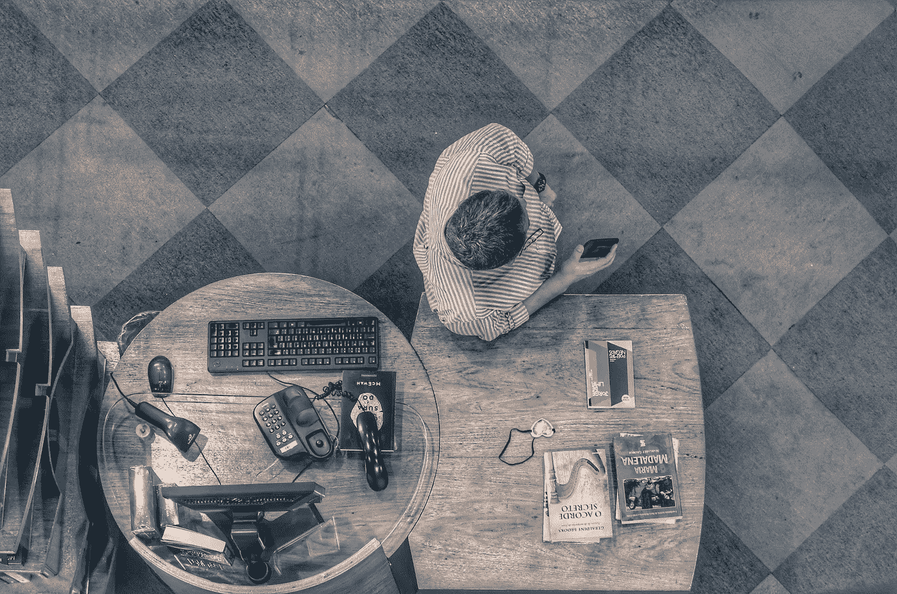

# 你的工作不是你糟糕生活的原因

> 原文：<https://medium.com/swlh/your-job-is-not-the-reason-for-your-shitty-life-2e3af6d4a7d6>

## 这实际上是塞翁失马焉知非福

Photo by [D A V I D S O N L U N A](https://unsplash.com/@davidsonluna?utm_source=unsplash&utm_medium=referral&utm_content=creditCopyText) on [Unsplash](https://unsplash.com/search/photos/jobs-hate?utm_source=unsplash&utm_medium=referral&utm_content=creditCopyText)

糟糕生活的罪魁祸首是糟糕的工作。

或者至少这是我们许多人选择相信的。

如果我们的生活很悲惨，我们会责怪我们的工作，这并不奇怪。我们讨厌工作，我们的老板，企业文化，政治，讨厌的同事…