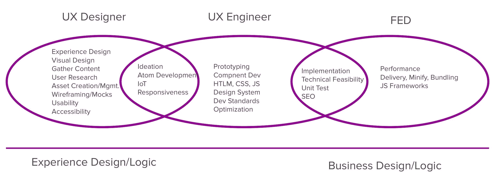

# 你的约翰尼·卡什在我的天堂:为什么设计师和开发者应该成为朋友

> 原文：<https://medium.com/swlh/your-johnny-cash-is-in-my-nirvana-why-designers-and-developers-should-be-friends-2f2b549120fd>

早在一天前，Reeces 花生酱杯的广告中，有人不小心将巧克力棒浸入另一个人的花生酱罐中…当时戴着 80 年代的泡沫风格耳机。瞧，我们知道了花生酱杯的起源。这是我在本周听 MTV live Nirvana 专辑时想到的。

你看，我认为最好的涅槃是心形盒子，少年精神和你来了，但在现场专辑的后半部分，我接触到了高原，火湖和昨晚你睡在哪里。这些都是我以前从未听过的好歌。这些曲目的突出之处在于它们听起来有多乡村。这就像一个现代的肮脏的意大利面西方配乐。所有这些都让我想起了约翰尼·卡什演唱九寸钉乐队的《伤心》时的精彩表演。当我们模糊界限，深入彼此的领域时，这有多好。

这让我想到了我们应该如何组织我们与 UX 设计师、UX 工程师和前端开发人员的前端开发。很多时候，工具、技术和目的重叠在一起，形成了美味的巧克力或跨物种的史诗般的宏伟。

去年，我们一直在推动我的公司提升 UX 工程师的职位。有趣的是，我们一直在进行这些讨论，试图找出界限模糊的地方，他们的责任是什么，以及我们如何吸引和聘用这些职位的人？

如果你是在现代开发世界中长大的，在这个世界中，我们在技术学校中教授更细分的工作，那么这一点可能看起来更明显，但对于我们这些已经在这个领域工作过一两次的人来说，这一点可能不那么明显，因为在这个术语存在之前，我们已经是全栈开发人员了。甚至可以追溯到我们第一次听到涅槃乐队演奏的时候，我知道这很令人震惊！尤其是当你和那些大半辈子都在编写 lambdas 代码、编写微服务或担心迁移到云的人交谈时。

由于 UX 团队结构有无数的机会，我们选择使用 UX 设计师、UX 工程师和前端开发人员。虽然在我工作过的一些地方，UI/UX 设计师开发人员角色发现你在前端代码中设计和实现功能，但我们选择了不同的途径。

作为我们数字化转型的一部分，我们看到 UX 设计师的角色拓宽了他们的 T 体验，成为团队所有研究的焦点。这意味着所有的研究都要经过设计师，这样他们就知道并且可以展示研究成果。他们与我们的 UX 研究团队建立了联系，自己进行基本的 UX 研究，使用我们的内部研究资源，或者与我们的第三方研究人员合作进行更大规模的工作。此外，我们已经通过培训和与我们的营销团队的经验来获得信任，让 UX 设计包括用户界面设计。图像、声音和品牌被提供给在视觉设计方面有一定技能和经验的设计师。第三个来自于远离业务分析师的发展。对于许多公司来说，我们已经看到了从英国航空公司到 UX 的转移，这似乎是齐头并进的，因为我们有 UX 的设计师为我们的设计冲刺提供便利。从这些冲刺中出现了积压的工作，描绘了路线图和需求，帮助我们的团队确定方向。在 UX 设计师已经满载的盘子上添加开发变得太多了。

这让我们想到了 UX 工程师的角色。由于我们公司的一个租户是“客户第一”，我们觉得我们想在这一点上有所作为，并确定用户体验。这开始了我们对那些精通设计和开发技能的特殊人群的独角兽搜索。他们的工作是确保我们所有的字体都是 San-serified，动画是动画，所有设备上的体验都是 point，我们让用户高兴。

UX Engineers make the designs come to life

这让我们想到一个问题，前端开发人员现在在做什么，因为他们夹在 UX 工程师和我们所说的云系统工程师之间，云系统工程师在历史上一直是编写服务/处理数据库等的人。责任线在哪里，我们如何吸引和聘用这两个职位。

我从我认为有助于定义他们使用什么技术开始。虽然他们都使用 HTML、CSS 和 JS，但他们使用的方式不同。我们讨论了 UXE 如何使用 HTML 来设计和开发响应原子(原子设计),而 FED 则更多地参与创建分子和为内容管理准备 DOM。在 CSS 的土地上，UXE 确保我们的媒体查询被设置，我们让 SASS 工作，而美联储正在考虑缩小和捆绑 CSS。在 JavaScript 世界中，UXE 正在考虑页面和组件的交互、微/动画、UI JS。美联储更关心 JS 库、ECMAScript 标准和 JS 的部署/消费。

谈论技术只会混淆问题，尽管这些技术并不总是看起来相距甚远。随着我越来越多地思考这个问题，从他们的目标和他们正在做的工作的角度来考虑这个问题，而不是从通常的通用技术的角度来考虑，这更有意义。如果我们开始认为 UXE 正在使用这些工具和技术来进一步构思、原型制作、可用性测试、UI 交互、设计架构，那么我们可以看到这与美联储对实现、技术可行性、积压管理、性能、路由、服务消费和 SEO 结构的关注有何不同，然后我们就可以更清楚地看到这些差异。

UXE 的重点是用户体验和从代码的角度取悦客户，而 FED 的主要关注点是代码的交付和架构。UXE 与 UX 设计师和 UX 研究人员的联系更紧密，而 FED 与云系统工程师的联系更紧密。这种区分在某种意义上变成了经验逻辑和商业逻辑。

我喜欢谷歌的说法，“UX 的工程师是设计和开发的综合体。他们采用谷歌最具创新性的产品概念，并将其融入生活，努力推动用户界面设计的发展。”他们探索产品概念，构建原型，与 UX 设计师和研究人员合作，并就 UI 实现最佳实践向前端工程师提供建议。

FED 或软件工程师“开发下一代技术，改变数十亿用户连接、探索信息以及与他人互动的方式。他们的职责是设计、开发、测试、部署、维护和改进软件。

差异有时是细微的，UXE 应该为可用性、可访问性、SEO、CSS 结构和命名设置标准，但美联储在很多时候是消费者和实施者。很多时候会有交叉，我们鼓励这样做，因为我们希望所有人都能够有更广泛的 T 经验。我们说角色有些不固定，我们鼓励探索，这有助于团队在合作愉快的同时前进。我们不想要正式的移交和过于结构化/僵化的流程。作为敏捷宣言的拥护者，我们希望在文档化的过程上有更多的互动和对话。

现在，对于我们如何找到并雇用这些人，我想出了几个测试问题。

1.  了解 Angular 8 改进的 web worker 捆绑或 CSS 变量，哪个更让你兴奋？
2.  你想在你的网站上安装新的功能，你考虑过 NPM 和 CLI 吗？或者是否应该在一个新的页面上显示，模态的或者弹出的？
3.  你更担心 HTML 和 CSS 验证还是你的 JS 链接得有多好？
4.  您更关心的是字体、颜色、尺寸、显示时间和英雄在移动/平板/笔记本/台式机上的轮播位置，还是每个英雄的文件大小、使用的字体数量以及对页面负载的影响程度？
5.  你更关心我们的 CSS 是 6000 行代码还是那个 or DOM 结构有 3700 个节点？

现在你可能会对自己说，这两个我都关心，但如果你不得不强迫自己只选择一个，你会选择哪个？我认为这将有助于你明确地站在哪一边。

在激动人心的戏剧《俄克拉何马》中，他们歌唱农夫和牛仔应该成为朋友。我相信我们应该唱同样的副歌，UX 的设计师、UX 的工程师和前端开发人员应该成为朋友。让我们一起努力，发布一些优秀的工作软件。太好了！