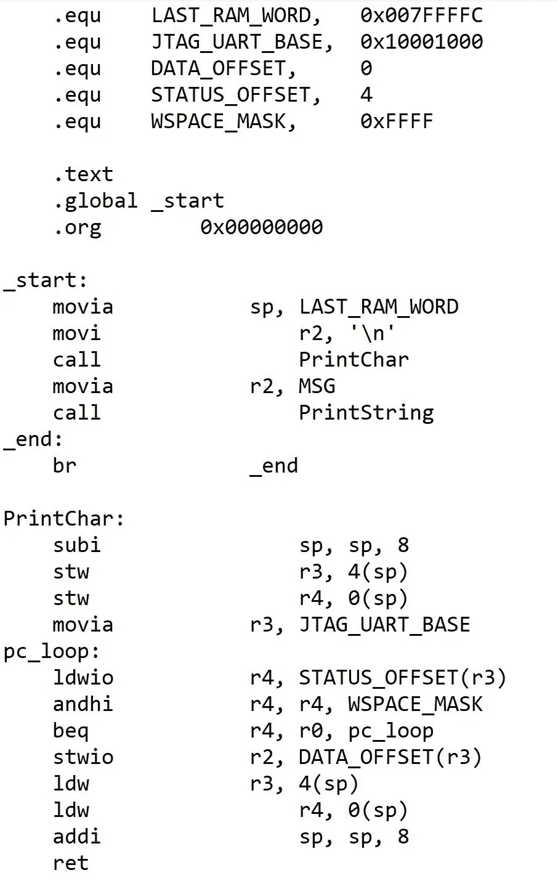
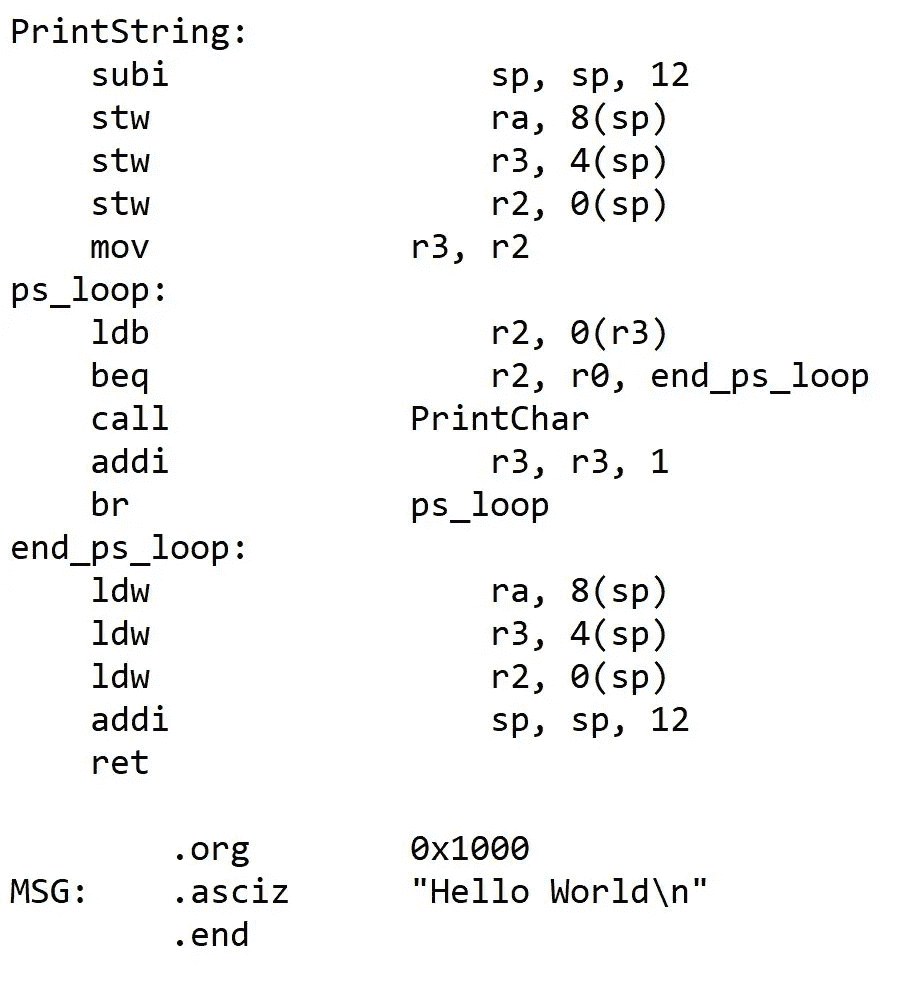
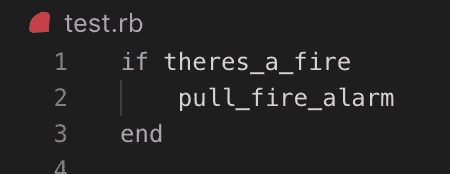
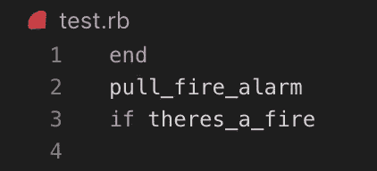
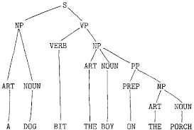

# 你的智能音箱不智能

> 原文：<https://medium.com/swlh/your-smart-speaker-is-not-smart-94df08bdf753>

> 任何足够先进的技术都等同于魔法。
> 
> -亚瑟·C·克拉克爵士

亚瑟·C·克拉克爵士的这句话准确地描述了先进技术是多么的先进，有时会与魔法相混淆。向我的父母介绍 Siri 就是这样一次经历。在他们的心目中，Siri 相当于一个人，可以在那里进行对话和解决任务。即使智能助理理解并能够完成广泛的任务，但它并不像你想象的那样聪明。

# 什么是语言

首先，我应该从解释语言是如何划分的开始。为了概括语言，我将它们分为三类:低级语言、高级语言和自然语言。

## 低级语言

你可能知道，计算机只能理解机器语言。机器语言是最低级的语言，它由一系列的 1 和 0 组成。低级语言本质上很难阅读和理解，因为它们是你从自然语言中所能获得的(如果你不确定什么是自然语言，它就会出现)。下面我已经包括了汇编代码的图像。

这段代码运行最常见的初学者代码“Hello World”。为了用通俗的语言解释代码，我们从设置我们在整个标签中使用的常数开始(标签基本上等同于方法，但实际上是内存地址，这在程序结束时会更清楚)。在那里，我们操作机器的内部寄存器来保存值，同时我们执行运算来打印出想要的单词，在本例中是“Hello World”。当程序结束时，它调用“_end”一个指向它自己的内存地址的标签。一般人自己无法理解代码在做什么(老实说，我不得不求我的兄弟教我，并以我的不理解来挫败他)。由于这些原因，程序员创造了高级语言，试图与自然语言更接近。

## 高级语言

创建高级语言是为了编写可读性更强的代码。目标是创造一种语言，由于它与自然语言的相似性，初学者可以很快学会。然而，由于自然语言的模糊性，问题还是会出现。人类能够理解抽象的概念，而机器却不能。高级语言要求程序员使用特定的词汇(关键字)和高度结构化的约定。用高级语言编写的代码只有 100%结合语言需求才能运行。当然，这和人类的交流方式有很大不同。只有用正确的格式编写的代码，计算机才能理解。

例如在 Ruby 中我们写道:

即使你没有 ruby 编程背景，这段代码也应该很容易理解。这段代码相当于说:

如果发生火灾，拉火警

但是，以下内容不起作用:

这段代码相当于说:

如果发生火灾，请拉火警

人类将能够理解这些指令的含义。即使你告诉他拉火警，他也能推断出你的意思是只有发生火灾时。另一方面，计算机不能处理这些。首先，这将导致编译或运行时错误，因为它不符合语言的语法要求。如果机器能够以某种方式编译这些指令，它就会在管理时直接阅读并遵循这些指令。因此，在这个例子中，计算机将首先拉响火警，然后检查是否真的发生了火灾。

## 自然语言

自然语言包括世界上所有的语言。你可以想象语言:习语、俚语和新单词都出现了。然而，与机器不同，人类可以根据句子的上下文推断出未知单词的含义。

例如，在英式英语和美式英语中，棺材意味着两种截然不同的东西。在英国，棺材指的是首饰盒，而在美国，棺材是棺材的另一种说法。然而，如果一个美国人告诉一个英国人，“我们为我爷爷的葬礼准备了一个橡木棺材”，他们会推断出你指的不是首饰盒。

# 为什么自然语言这么难

目前教授计算机自然语言几乎是不可能的。人类在表达自己的时候并不总是明确的。然而，根据上下文推断和推断信息的能力是人类拥有的技能，而计算机却没有。

在英语中，同一个单词经常用来表达不同的事情，例如，我们可以说“我要去学校 *ball* ”或者我们可以说“你能把*的球*递给我吗”这两个都是正确的短语，但是，单词“ball”在这些例子中意味着两种非常不同的事情。机器将无法破译球在上下文中是什么。

这就把我们带到了实现自然语言的问题上。在口语中，单词有多种含义是很常见的，说话者可能有浓重的口音，说多种语言，发错单词的音，语法错误，并以多种方式表达相同的想法。即使面对所有这些挑战，人类仍然能够理解和克服这些问题。然而，正如你所想象的，计算和调整计算机来克服这些挑战几乎是不可能的。

# 自然语言处理如何应对这些挑战

如上例所示，单词 ball 可以有多种含义。让计算机访问在线词典并不足以让计算机准确理解你指的是什么。由于这些原因，我们必须创造一个短语结构。

## 短语结构

短语结构是语言遵循的一套规则。例如，我们知道所有的句子都必须包含一个名词和一个动词。因此，我们知道“高个子约翰”不是一个完整的句子，就像“约翰跑了”一样。我们使用这些短语结构将句子分成计算机更容易处理的小片段。这些位被组合成一个解析树。

## 解析树

解析树是必不可少的，因为它揭示了一个句子是如何构造的。从上面的例子中，我们现在知道这个句子是关于一只狗和它所做的事情。通过将句子分解成这些更小的积木，计算机已经变得非常擅长解决任务。局限性仍然存在，因为极长且复杂的句子超出了目前计算机的能力。

# 智能助手的未来是什么样子的

对于那些害怕天网崛起的人来说，请记住计算机目前的严重局限性，不要被表面的“智能技术”所迷惑。目前，智能助理显示器的人工智能被称为人工狭义智能(弱人工智能)，这种水平的人工智能能够在非常窄的范围内模仿人类的智能和行为。这就是为什么当命令变得越来越复杂时，智能助手很难理解你的意思。人工智能的下一个层次是人工通用智能和人工超级智能。

## 人工通用智能

人工通用智能(强人工智能)是人工智能发展的下一步。有了强大的人工智能，计算机将能够模仿人类的智力和行为。最终通过图灵测试成为人类。这是《终结者》等电影中最常表现的。

## 人工超级智能

人工超级智能(Super A.I .)是人工智能的最终水平。很难想象它能做什么，但可能性是无限的。有了计算机的能力，它将能够自己成倍地增加它的知识。这是人类最害怕的人工智能水平，在这种水平下，计算机将能够快速获取如此多的知识，以至于人类无法跟上它们。

## 好的一面

即使人工通用智能被推测是可能的，但目前的技术限制和人类知识使强人工智能的发展在这一点上几乎不可能。为了使强大的人工智能成为可能，计算机需要有自己的意识，但即使是人类也还没有理解意识是什么，所以如果我们不能理解意识，我们怎么能把它教给计算机呢？