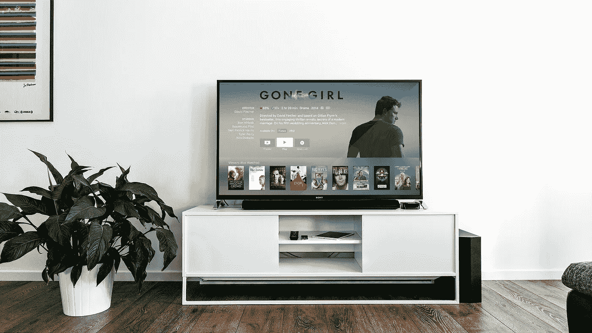

# 你的“智能”电视是一个愚蠢的想法

> 原文：<https://medium.com/swlh/your-smart-tv-is-a-dumb-idea-c4123392a3b4>

Smart TVs are far better than their predecessors … but they come with hidden costs.

售价 349 美元的内置 Roku [的海信 55 英寸 4K LED 平板智能电视听起来很划算，不是吗？](https://www.bestbuy.com/site/hisense-55-class-led-h6-series-2160p-smart-4k-uhd-tv-with-hdr/6251609.p?skuId=6251609)

这不是什么“黑色星期五”特价或“刮刮乐”大甩卖，这是正常价格。在一些零售商那里，你甚至可以得到特价——我见过这种型号的售价低至 299 美元。想要更低吗？百思买的 Insignia 品牌型号零售价稍微便宜一点。更喜欢…