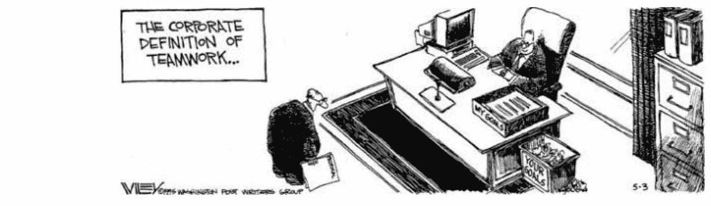

# 你总是在为某人工作

> 原文：<https://medium.com/swlh/youre-always-working-for-someone-e0e9d5b081f0>

## 一个工人的工作故事

Source: [https://www.gocomics.com/nonsequitur/1995/05/03/](https://www.gocomics.com/nonsequitur/1995/05/03/)

一位美国外交官在电话中告诉我，你总是在为某人工作。出乎许多人意料和震惊的是，这次采访发生在唐纳德·特朗普当选白宫后不久。我在读研究生，正在找暑期工作。

采访者说，你总是在为某人工作，这可能是在向我暗示，是的，他是一名外交官员，拥有最有声望的工作之一，住在海外，并以代表美国为荣，但仍然必须服从命令——来自特朗普和他的政治雇员的命令。我推测，当他看到我的名字时，可能推断我应该意识到后果，为政府工作可能与我的价值观相冲突。

直到今天，这是我从那次谈话中唯一记得的事情。听到这个警告对我来说很奇怪，你总是在为某人工作，因为直到那一刻，我从来没有一个面试官，或者事实上任何人，提醒我我总是在为某人工作。

对许多人来说，这种警告似乎是不必要的，尤其是像我这样的工人阶级。这是生活中不容置疑的社会事实之一，就像——你需要钱来生活。我们大多数人都不会成为自己的老板。许多人甚至不会考虑这种可能性。有些人会尝试成为小企业主或企业家。但许多人最终会被某个人雇佣。

如果一个人总是为某人工作，那么这个人是谁？回答这个问题就是进一步询问谁在掌权。[工作是一种社会统治制度](https://theanarchistlibrary.org/library/bob-black-the-abolition-of-work)。从古代的专制君主到封建领主再到国家独裁者，人们总是与不公正和专横的权力打交道。人们一旦认识到这种力量，要么默认，要么反抗。出于显而易见的原因，人们常常选择保持沉默。通常只有饥荒和战争才会促使人们造反。

在民族国家和资本主义兴起之前，人们还有另一种选择，要么退出，要么不再玩这个游戏。受够了这个地势低洼的农业州的专横权威的人们可以收拾行囊，前往山区。当然，我们不再有这种选择，因为每块土地都归国家或一些富人所有。即使是超级富豪也依靠国家的强制力来保护他们的私有财产。人们一看到压迫就知道了。但是，一个人能否清楚地表达等级社会关系，一个人是否想改变这种关系，一个人能否找到替代方案，则是另一回事。

与之前的外交官不同，我们大多数人不为美国联邦政府工作。我们中的许多人在公司工作，或者有人会说，在私营部门工作。在这种情况下，一个人为谁工作这个问题的答案并不十分明确。

在面试之前，我已经在私营部门工作了七年多。这个雇主是从现代资本主义组织模式中切割出来的。这家公司有一个拥有数万名员工的等级结构。为了管理这些工人，它需要成千上万的经理。他们上面是公司经理。然后是董事会。由于该公司是上市公司，有机构投资者持有大量股份。公司经理和投资者的利益与股票的所有权和价格联系在一起。与占据现代公司最底层的工人不同，公司经理和他们的中层管理人员的很大一部分报酬来自出售公司股票。

在这家跨国公司，我的主管经理当然有权因我不服从命令或工作表现不佳而解雇我。但员工经常因为其他原因被解雇:为了快速降低成本，或者向华尔街发出信号，表明公司认真对待盈利。所以，当我的团队，包括经理，因为公司想利用印度的劳动力套利而被解雇时，我并不清楚是谁在做最后的决定。或许罪魁祸首是我们的公司经理、董事会或华尔街机构投资者。如果这些是我的老板，在我为老板工作的这些年里，我从未见过他们。但他们是做出重要决定的个人:生产什么，在哪里销售，雇佣和解雇谁。我确信他们不知道我的存在。即使我对他们来说确实存在，我也只是电子表格上的一个数字。这是我为别人工作时接受的事情之一。我只是很高兴有一份工作。

无论是总统的独裁，还是企业管理者或投资者的独裁，为别人工作都是一种被支配的行为。一个人是否喜欢她的老板不会改变社会关系的性质。当这位外交官，我的采访者说，你总是为某人工作，这是他的从属地位的反映或实现。公共部门和私营部门之间的区别并不在于一个人是否处于从属地位，而是在某种情况下，一个人为谁工作更加明确。一般来说，像外交官这样的一些工人可以退出公共部门，希望为私营部门中不那么滥用权力的人工作。特朗普当选总统后，数百名中高层官员离开了国务院。但这只是该部门在册员工人数的一小部分。许多工人没有这种选择，只是简单地更换雇主。

当我在私营部门为我的雇主工作时，我无法清楚地说出它对我生活的不同支配方式，无论是在工作场所内外。我并没有从智力上意识到工作是一种统治机构。我用眼睛看不见的东西，我用我的思想和身体去感受。我记得我被迫坐下来听我的经理谈论一些我不同意或不太关心的事情。我记得我假装从三点工作到五点，因为我已经完成了我的工作，但直到社会允许的时候才能回家。我记得我经常做一些缺乏智力和创造力的事情。我记得当裁员即将发生时，管理层告诉每个人继续工作，假装他们不知道被解雇的事。

与辛苦从事体力劳动的产业工人不同，企业工人遭受着一种精神暴力。我的父亲是一名汽车修理工，他的双手伤痕累累，变得僵硬。与他不同，我没有任何身体上的痕迹来证明我的挣扎。有时候，我会为比较我们的工作经历而感到羞愧。然而，在我在该公司工作的最后一天，我被诊断患有偏头痛先兆，这是一种无痛性偏头痛，会导致头晕和暂时丧失语言能力。

工作场所的支配地位对我产生了有害的影响。所谓的工作场所健康是行业为缓解工作症状而创造的。与普通感冒不同的是，我们知道，工作不会随着感冒的缓解而好转。我去土耳其和秘鲁的假期是为了逃避工作。我在大学里学的是软件工程，并在一家科技公司工作，这并不重要。学习编程的决定既是因为劳动力市场的要求，也是我自己的愿望。

高中的时候，在决定上大学之前，我唯一的工作经历就是在一家快餐店打工。当我成为一名技术工人时，我以为我已经到达了黑暗的尽头。但这不是我想象中的阳光，而是荧光灯发出的光。我抓着这盏灯就像咕噜抓着戒指一样。如果我放手，我会害怕黑暗。如果我放手，我害怕失去我努力获得的东西。我看到我的同事坐在那里等着被解雇，这样他们就可以得到遣散费。或者他们等待，因为他们不必自己做决定，他们知道如果他们真的辞职，他们会受到朋友、家人和同事的质疑。

我最终离开了我的雇主，但直到几年后我有了空闲时间(虽然不是空闲时间)来阅读、思考和写作这些事情时，我才完全明白发生了什么。我发现我确实有智力和创造力。如果我留下来等待，时间，我最宝贵的财产，将继续被我的雇主占用。

但是，雇主、劳动力市场和国家共同努力来惩罚那些试图过上有尊严的生活的人，一种没有老板控制和偷窃时间的生活。对我们中的许多人来说，完全退出劳动力市场几乎是不可想象的，除非一个人有可观的储蓄或即将退休。我不知道除了这种我们称之为工作的统治体系，还有什么别的选择。但是为了离开虐待关系，你需要首先认识到这是虐待。我认为这种认识需要我们有勇气反思如何利用时间，而这正是我们在工作和娱乐文化中极度缺乏的。