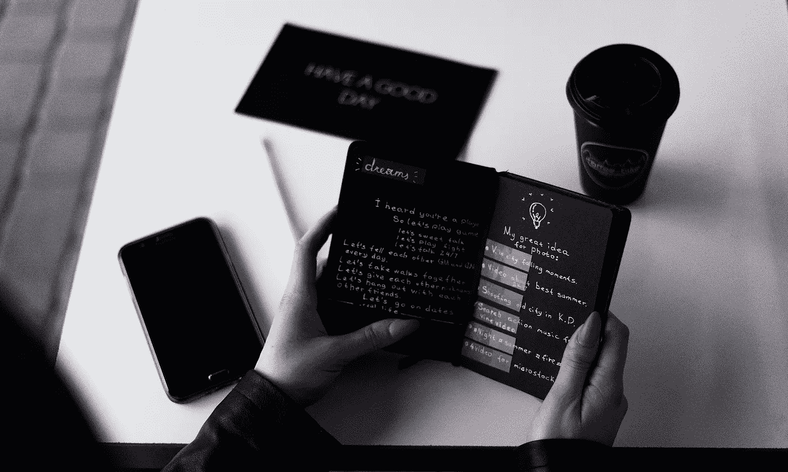

# 你不是没有主意了，而是屈服于恐惧

> 原文：<https://medium.com/swlh/youre-not-running-out-of-ideas-you-re-giving-into-fear-19b7c5a57287>

## 以下是你如何产生持续的创造力的方法。

By: [Elijah O’Donnell](https://unsplash.com/@elijahsad) on [Unsplash.com](https://unsplash.com/)

> “开始永远是今天。”——玛丽·雪莱。

B 开始做任何事情都会给我们灌输一种恐惧，这种恐惧我们将用余生去理解。事实是不管…