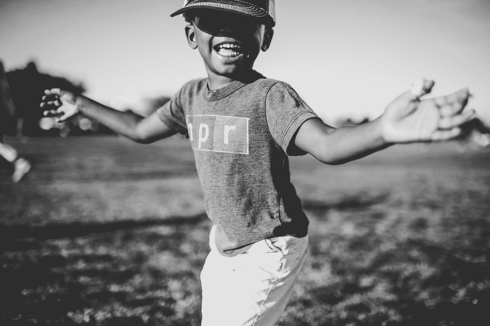

# 你还不算太小，不足以激励他人

> 原文：<https://medium.com/swlh/youre-not-too-small-to-inspire-someone-3d5ce690e765>

Photo by [frank mckenna](https://unsplash.com/@frankiefoto?utm_source=medium&utm_medium=referral) on [Unsplash](https://unsplash.com?utm_source=medium&utm_medium=referral)

## 你还没大到可以向任何人学习。

我们经常低估或者高估自己完成几乎每项任务的能力。也许这是我们完成这些任务的唯一途径。也许如果我们真的能评估我们的能力，我们就不会做任何事。

如果一个孩子知道它不会走路，因为它从来没有走过路，为什么还要麻烦呢？