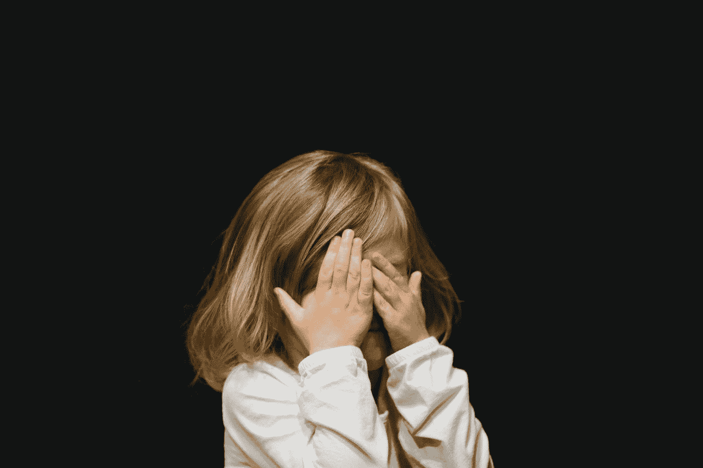

# 你没事:幼儿的教训

> 原文：<https://medium.com/swlh/youre-ok-lessons-from-toddlers-52c64c1bed7f>

## 即使随着年龄的增长，我们也想知道自己是否安好。

Photo by [Caleb Woods](https://unsplash.com/@caleb_woods?utm_source=medium&utm_medium=referral) on [Unsplash](https://unsplash.com?utm_source=medium&utm_medium=referral)

当我的一个侄子或侄女摔倒时，这个小个子周围的看护者会立即齐声喊道:“你没事，你没事，你没事。”

他们的音调甜美，歌声嘹亮，笑容灿烂，房间里的每个人都屏住呼吸，希望这个蹒跚学步的孩子不会…