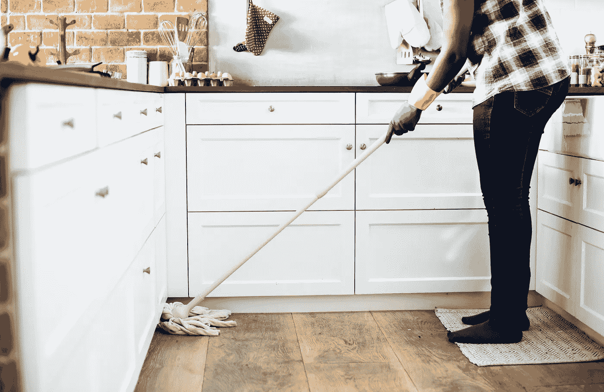

# 你还像个孩子一样在学习

> 原文：<https://medium.com/swlh/youre-still-learning-like-a-kid-2c809466a75d>

## 像成年人一样学习的时间到了

当我来到大学，发现还有其他获取知识和技能的方式时，我与学习的关系开始发生变化。除了我在学校时习惯的那些。即便如此，仅仅知道新的学习技巧并没有帮助我。我不得不把它们付诸实践，变得更有条理和纪律性。说起来容易做起来难。

经过多年对不同方法的测试，作为一名学习者，我更加了解自己，我的使命是帮助别人也这样做。因为自主学习会带来自由、快乐和力量。

这件作品讲述了三件事:

*   我们过去是如何学习的；
*   我们现在是如何学习的；
*   我们应该如何开始学习。

# 我们过去是如何学习的

你还记得我们 10 岁时的那些周六吗？我们以为终于可以睡懒觉，看卡通片，和朋友一起玩了。然后百叶窗被拉上了，我们醒了。

今天是家务日！一天和一周没什么不同。

Photo by [rawpixel](https://unsplash.com/photos/qykdKVmMa2o), on Unsplash

想想吧。

我们的父母会告诉我们去哪里打扫。就像我们的老师会告诉我们该学什么一样。

他们告诉我们使用什么工具，但没有解释原因。**就像我们的老师会告诉我们什么样的学习方法最合适，却从不解释为什么。**

最后，他们会评估结果，而不解释评估标准。**就像我们的老师会建立评估方法，给我们一个等级，很少给我们一个为什么那么低或那么高的理由。**

我们以前在家里是父母主导的环境，在学校是老师主导的环境。

随着我们的成长，如果我们不想生活在混乱中，我们就必须做家务。如果我们不想让我们的知识变得一团糟，我们也应该在学习过程中变得有纪律。

首先要承认我们在童年和青年时期养成的习惯，这些习惯现在对我们不利:

*   我们不知道如何评估自己的学习需求，设定学习目标；
*   我们不知道如何构建我们的学习过程，使用最佳方法来适应我们的学习目标；
*   我们不知道如何评估我们的知识。

# 我们现在如何学习

我们长大了，我们读完了大学，然后我们找到了工作。学习从不停止，所以我们在日常活动中保持学习，但我们也保持旧习惯，培养新习惯:

*   我们学会了以前打扫卫生的方式。我们不知道从哪里开始，需要多长时间，或者结果应该是什么。
*   我们以过去的方式学习。**因为别人这么说，通常我们老板和我们工作的公司。**
*   我们学习购买衣服的方式。一种趋势出现了，我们开始学习它，因为它很酷，每个人都这么做。

我们仍然没有自己的学习过程。

# 我们应该如何开始学习

像成年人一样。

Photo by [J. Kelly Brito](https://unsplash.com/photos/PeUJyoylfe4?utm_source=unsplash&utm_medium=referral&utm_content=creditCopyText) on [Unsplash](https://unsplash.com/search/photos/learning?utm_source=unsplash&utm_medium=referral&utm_content=creditCopyText)

在学习方面，成人的需求与儿童不同。

*   他们需要知道。他们需要了解学习的必要性。在他们愿意投入时间和精力去学习它之前，如果他们做了会对他们有什么好处，如果不做会对他们有什么危害。
*   **需要把自己的经历考虑进去。**与儿童不同，在一群成年人中，找到不同背景和经历的人的机会更大。这导致他们有不同的学习风格、速度、不同的需求和兴趣。
*   **使学习适应学习者学习意愿的需要。**当成年人在现实生活中体验到学习的需要时，他们会变得乐于学习。由于每个人的生活情况不同，他们在不同的时间准备学习不同的东西。

有一种工具可以满足所有这些需求——**学习合同**。

> 学习合同是用于帮助规划学习项目的文件。它是学习者和指导者之间的书面协议，即为了达到一个或多个特定的目标，将进行特定的活动。杰夫·安德森，大卫·博德，简·桑普森——学习契约:实践指南

学习合同如何满足成人学习需求？

*   他们需要知道。在写学习合同之前，学习者要进行个人学习需求评估。此外，当选择合同的学习目标时，他们应该写下的第一件事是“为什么”他们要设置它，将给他们带来什么好处，以及它如何适应他们的整体环境。
*   将自己的经历考虑在内的需要。契约学习是高度个性化的。完全是你的，你写下来，唯一重要的背景是你的。尽管 5 个人可能有相同的目标，但他们实现目标的方式可能会像他们的背景一样不同。
*   **需要使学习适应学习者的学习意愿。**学习合同提供了灵活性，让学习者根据自己的准备程度选择何时学习。不准备学习机器学习，AI，积极心理学？别担心，从基础做起，你会成功的。没有人会质疑你的决定。

# 我如何通过使用学习合同帮助一个设计师构建他的学习过程

Adrian Ciulei, Creative Director @[studiohumm](https://www.studiohumm.com/)

当我的一个老熟人请我帮助设计他的设计工作室的学习环境时，我真的不知道从哪里开始。

简报中的一个要求是**帮助他们在学习过程中变得更加自律。**

我向学习型组织和成人学习领域的一些名人寻求帮助:彼得·桑格、T2、马尔科姆·诺尔斯、T4、彼得·布朗、帕特里夏·克罗斯和其他人。

他们都帮助我理解了什么是学习环境和自我导向学习的先决条件。在我的研究中，我遇到了学习契约的概念，以及学者如何帮助学生发展它们。这基本上是对传统教学和评估方法的一种革新。

所以这是我建议他们应该学会的最重要的事情之一。他们将开始使用学习合同，我将开始在他们的学习过程中担任教练。

> 与拉维尼娅一起工作并使用学习合同被证明是我学习过程中缺失的一块。在那之前，我的学习是零星的，缺乏完成工作所需的专注。有一些我个人和在设计工作室开发的最佳实践，但是缺乏一个合适的结构。
> 
> 学习合同的主要好处是它的个性化方面，这来自我们一对一的谈话。我的学习目标的过程和结构完全由我来设定，以便合同尽可能有效地影响我的工作方式。
> 
> 用简单的文字和明确的时间表把它写下来有助于我保持责任感，不会落后于我的学习目标。但即使发生了这种情况，回头看看哪里出了问题并从中吸取教训也要容易得多。
> 
> 通过这种方式，我对自己和我的学习方式有了一些重要的认识，在过去的 6 个月里我一直在练习。有了这些新的知识，我可以改进我的下一份合同，更好地说明我目前的学习状态。

# 在这个过程中我学到了什么？

*   在组织中引入这种新技术需要事先准备。所有的学习者必须明白为什么，结构和他们应该得到的建议，而起草他们的学习合同。
*   不同的人需要不同程度的支持。有些人只在撰写合同时得到支持，其他人则需要事后辅导。作为一名教练，你应该在整个过程中随时待命。
*   学习者混淆了学习意图和实现学习意图的方法。"阅读关于…"的书，"接一个项目…"不是学习目标，因为它们不能确定学习的意图。学习者和向导都应该花时间细化目标。

但最终，我注意到的，尤其是在辅导过程中，是在诊断学习需求、设定目标、研究适当的材料和自我导向学习技能的全面提高方面的改进。

最终，我们在学校养成的习惯可以改变，我们可以掌控自己的学习过程。我们只是需要一点帮助。:)

# 如果你也想学习合同，我们为你准备了一本行动手册:

*   你应该开始使用学习合同的原因列表；
*   学习者和指导者的责任清单；
*   学习合同示例；
*   学习合同模板；
*   如果您是第一次使用此工具，可以使用一个清单来帮助您；
*   关于这个主题的书单。

我很乐意与你分享更多的学习技巧。跟我上 [**中**](/@laviniamariamehedinu) **！**

拉维尼娅·mehedințu 是一个自我导向的学习者，总是试图从她的学习过程中获得最佳效果。她梦想通过自己的工作改变人们的思维方式和教育体系。

## 这篇文章发表在 [The Startup](https://medium.com/swlh) 上，这是 Medium 最大的创业刊物，拥有+423，678 名读者。

## 在此订阅接收[我们的头条新闻](https://growthsupply.com/the-startup-newsletter/)。

