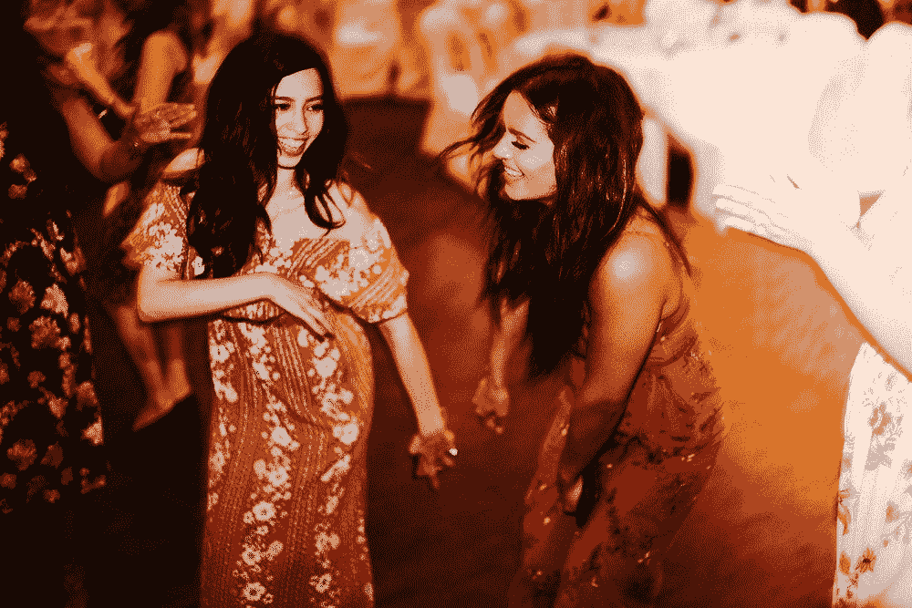
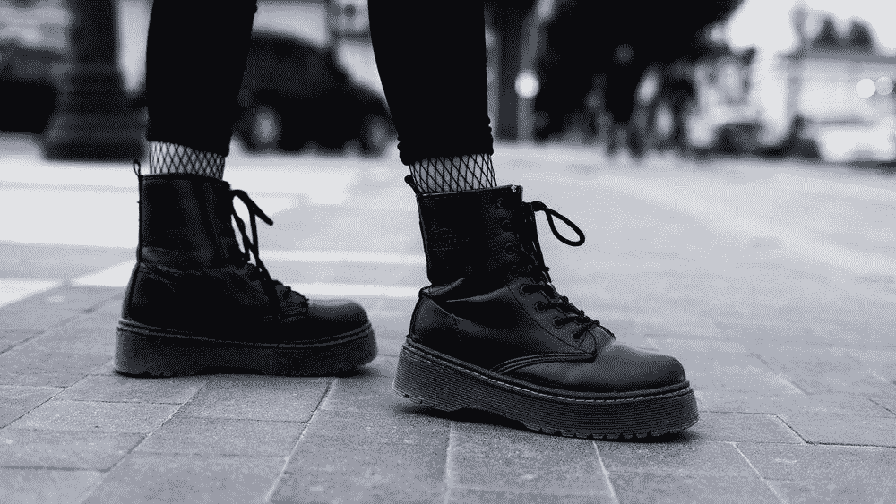
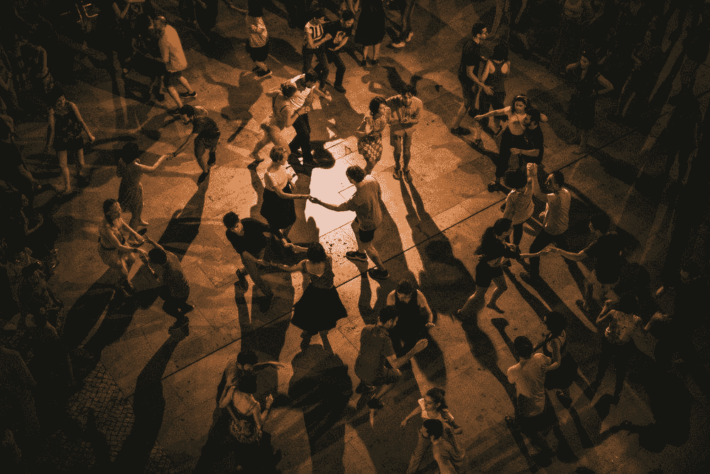

# 你从没在舞池里放开过？方法如下:

> 原文：<https://medium.com/swlh/youve-never-let-go-on-the-dance-floor-here-s-how-5b14619d7057>

Omar Lopez on Unsplash (@Omarlopez1)

# 夜晚来临了，每个人看起来都很开心地在跳舞。你想“要是我能加入他们就好了…”

我们都从这些相同的想法开始。

如果不是一个朋友鼓励我们玩得开心，我们可能只是壁花。

这位朋友可能一开始甚至没有说服你，而是自己开始在那里跳舞。

然后你接受了社会的允许，让一切都过去，走向舞池，加入他们。

…这在某个时候对每个人都有效，对吗？但如果你从未有过那个时刻呢？

> "每天都有机会让你深吸一口气，脱掉鞋子，然后跳舞。"
> 奥普拉

如果你想走出去开始跳舞，这里有个秘密:

## 移动你的脚。

克服任何在公共场合跳舞的焦虑就是这么简单，我来解释一下为什么。

说到跳舞，没人告诉你的最大秘密是脚的运动。

笨拙舞蹈的定义是当某人移动他们的手臂或躯干，而保持他们的脚不动。这告诉其他人你身体上不能移动你的脚。

我希望我能在屋顶上喊出这个重要的建议。这可能会拯救许多自觉的未来婚礼参与者。

Elijah O’Donnell (@Elijahsad)

所以试着…两步舞。

只是交替地把你的脚放在一边，或者放在前面。然后让另一只脚也这样做。

如果你开始向不同的方向打手势，就会加分。

你会惊讶于轻盈的感觉是如何增加自信的…

因为在内心深处，你想跳舞。

和别人一起随着音乐的节拍移动你的四肢的兴奋感是最棒的集体体验之一。

Adrain Lumi (@adrianlumi)

> “生活就是音乐，从你血管里的血液开始。一切生物都有节奏。你感觉到你的音乐了吗？”
> **迈克尔杰克逊**

随着节奏旋转也有治疗作用。哈佛神经科学研究所支持 2008 年的说法，即音乐刺激大脑的奖励中心，而舞蹈激活其感觉和运动回路。

这是一个愉快的“双杀”

谁不想改善记忆和加强神经联系呢？

最后…

# 妙语是无论如何生活都会“抓住你”。

无论是生病还是受伤，你都会在某个时候没有跳舞的能力。

我们的骨骼和关节不允许我们弯曲，更不用说有一天会摇摆。

你可以向你所崇拜的更高的存在表达你的感激之情，只需摇动你母亲给你的东西。

你也可以感谢她。

当别人跳舞时，错过了过去或错过了现在的感觉，比任何指引你去剪小地毯的判断都要糟糕。

> “没人在乎你跳不好。起来跳舞吧。伟大的舞者之所以伟大，是因为他们的激情。”
> **玛莎·葛莱姆**

只要动动你的脚，想想它的好处，记住多年后没有人会回忆起这些转瞬即逝的瞬间

…除非他们在别人跳舞时站在一边。

小奖励报价:

> “让我们读书，让我们跳舞；这两种娱乐绝不会对世界造成任何伤害。”
> **伏尔泰**

顺便说一句，在 goodthingspotting.com[有好事情发生。](https://goodthingspotting.com/)