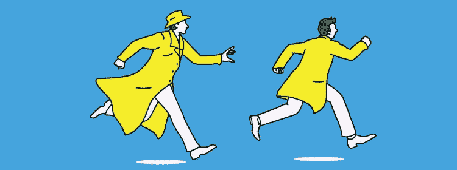

# 坦率、唠叨的权利以及不再跑步所带来的权力的零成本

> 原文：<https://medium.com/swlh/zero-cost-of-candor-nagging-rights-and-the-power-that-comes-from-not-running-anymore-7a90cd3b5a8>

获得生命中最好的关系并让它们变得更有价值的秘诀是什么？如果你生命中最亲近的人可能是你最大的财富呢？如果他们诚实的见解是你打开新的大门和实现目标所需要的东西呢？