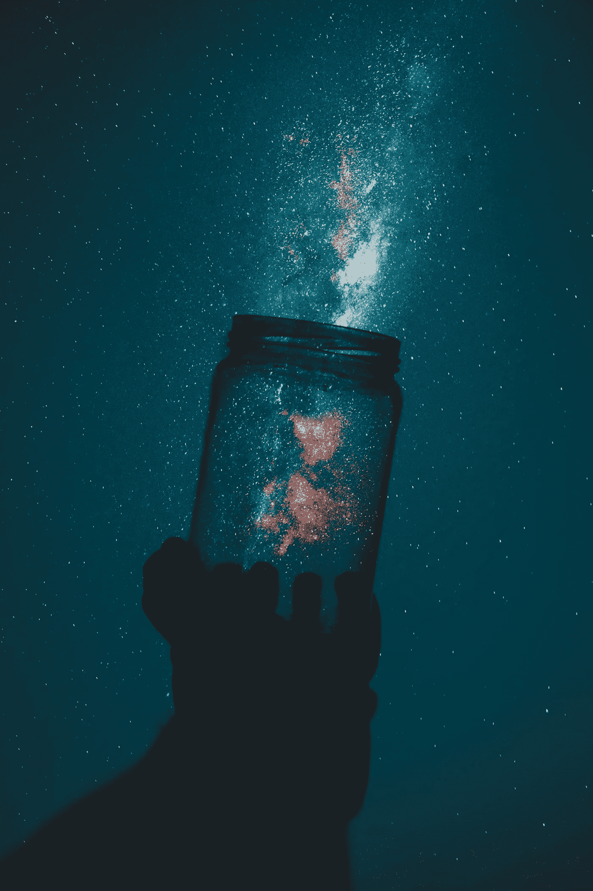

# 零阻力创意

> 原文：<https://medium.com/swlh/zero-resistance-creativity-eff98f16fa65>

Photo by [Rakicevic Nenad](https://www.pexels.com/@rakicevic-nenad-233369?utm_content=attributionCopyText&utm_medium=referral&utm_source=pexels) from [Pexels](https://www.pexels.com/photo/silhouette-of-person-holding-glass-mason-jar-1274260/?utm_content=attributionCopyText&utm_medium=referral&utm_source=pexels)

这是我最近开始使用的一个术语，用来描述我的创作哲学。我过去常常从心流的角度来思考创造力，虽然我仍然喜欢这个概念，但我发现对一些人来说有点难以理解。零阻力创意是我寻找快乐媒介的尝试。这是一个创造性的过程，我相信任何人都可以采用，并为他们独特的感受和情况而工作。