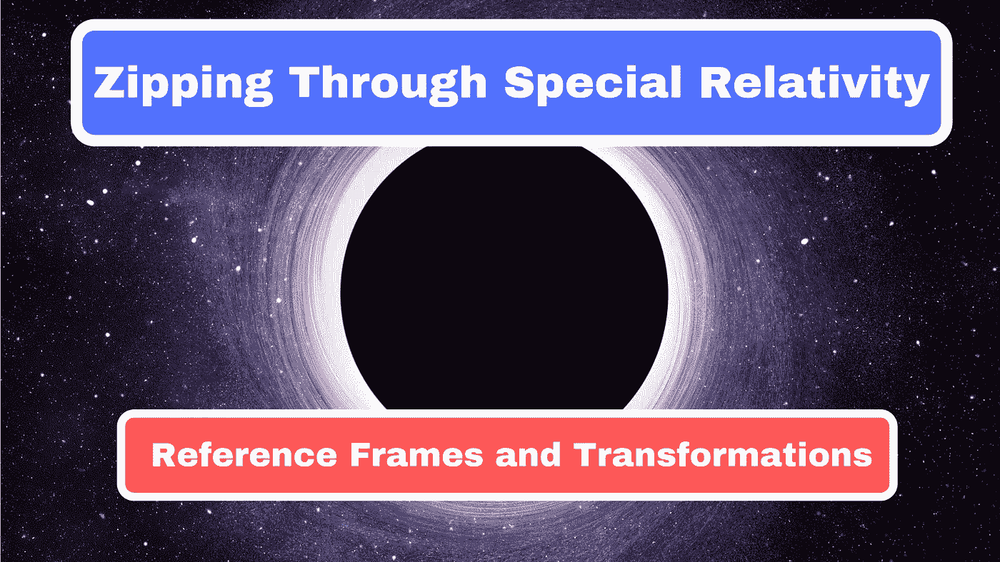

# 穿越狭义相对论:参考系和变换

> 原文：<https://medium.com/swlh/zipping-through-special-relativity-reference-frames-and-transformations-a871d458b28a>

## 爱因斯坦的狭义相对论不仅重塑了我们对物理学的看法，也重塑了我们对空间和时间的概念。在这里，我们探索理解狭义相对论所需的基础知识。