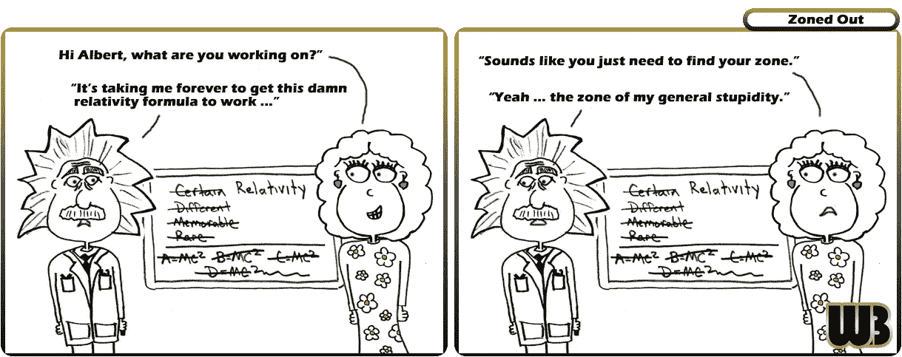

# 天才地带

> 原文：<https://medium.com/swlh/zone-of-genius-cafeb8151d9b>

昨天，我有幸看到有人在他们的天才区。我和令人惊叹的安雅·罗曼诺娃(Anya Romanova)共同主持了一个研讨会，这就像在看一个摇滚明星。我认识安雅已经有一段时间了，我已经知道她很棒，但这次不一样。她超越了现实，她超越了生活。她说话时，你可以听到房间里一根针掉在地上声音。当你看到有人处于他们的天才地带时，这真的是一件值得一看的事情。